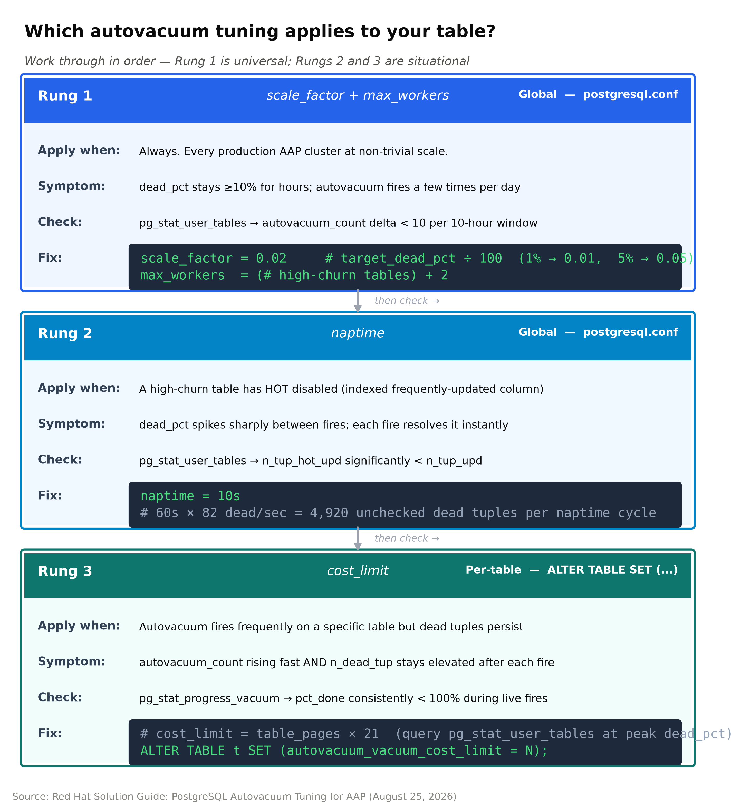
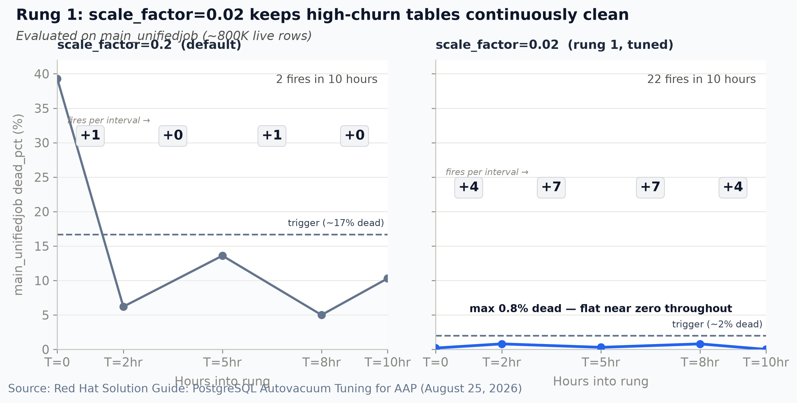
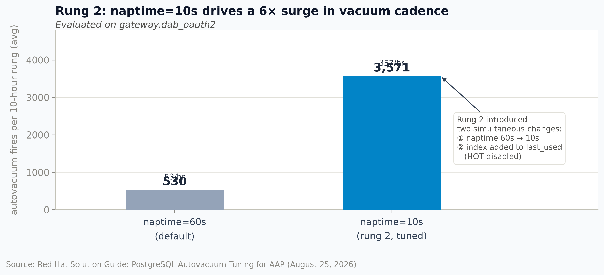

# PostgreSQL Autovacuum Tuning for Ansible Automation Platform — Solution Guide

## Overview

AAP at enterprise scale writes incessantly to large tables in its PostgreSQL database, keeping track of: job execution records, authorization tokens, and host health checks. PostgreSQL's default autovacuum settings were designed for smaller, less write-intensive databases and do not keep pace with this workload.

Every UPDATE and DELETE in PostgreSQL leaves behind a "dead tuple" - the old row - rather than modifying the row in place. On large, frequently-written tables these accumulate quickly: at production AAP scale, a single high-churn table can generate ~27,000 dead tuples per hour. With default autovacuum settings, these dead tuples can wait around for more than 6 hours before autovacuum clears them. While they wait, queries must still scan over dead tuples even though they are invisible to them, degrading performance and, at scale, producing user-visible slowdowns.

This guide documents three targeted parameter changes, tested in order of impact, to correct this problem and keep large tables continuously clean. See **Key Terms** at the end for definitions.



**Work through the rungs in order.** Rung 1 is universal, applying to every large AAP
deployment. Rungs 2 and 3 are conditional; apply them when diagnostic tests confirm
they are needed.

## Table of Contents

- [The Baseline: What Default Settings Look Like at Scale](#the-baseline-what-default-settings-look-like-at-scale)
- [Rung 1: Lower the Trigger](#rung-1-lower-the-trigger)
- [Rung 2: Increase Check Frequency](#rung-2-increase-check-frequency)
- [Rung 3: Ensure Each Pass Completes](#rung-3-ensure-each-pass-completes)
- [Validation](#validation)
- [Troubleshooting](#troubleshooting)
- [Where to Start](#where-to-start)
- [Related Guides](#related-guides)
- [Key Terms](#key-terms)

## Prerequisites
- Superuser access to the AAP PostgreSQL instance
- Ability to edit `postgresql.conf` and run `SELECT pg_reload_conf()`
- Operational impact: **Low** as all changes are reversible; `scale_factor` and `naptime`
  take effect on reload with no restart required

> **OpenShift / CNPG deployments:** Set parameters in the Cluster custom resource under
> `.spec.postgresql.parameters`, then apply with `oc apply`. A `pg_reload_conf()` call is
> not needed — CNPG handles the reload. Per-table `ALTER TABLE` commands (Rung 3) are
> applied the same way via `psql`.

---

## The Baseline: What Default Settings Look Like at Scale

In a large AAP deployment, the database receives a continuous stream of writes: every executed job creates and updates records in `main_unifiedjob`; every API call touches the OAuth2 token table; every automation run updates host metrics. Tables grow to hundreds of thousands of rows and are updated thousands of times per hour. In this environment, PostgreSQL's default setting `scale_factor=0.2` falls short.

The chart in Rung 1 (left panel) shows `main_unifiedjob` under default settings:

- Dead rows stood at 39.3% at the start—reflecting accumulated bloat from high write volume prior to tuning.
- Despite the bloat, autovacuum fired **only 2 times** in 10 hours. While vacuuming cleared the table each time,
  it could not keep up with the accumulation rate.
- Dead_pct climbed back to 10.3% by the end of the rung and was continuing to rise.

The root cause: `scale_factor=0.2` means that, at this scale, autovacuum waits for 160,000 dead
tuples on an 800K-row table before acting. At ~27,000 dead tuples/hour, that
threshold is crossed every ~6 hours. *The table never stays clean.*

---

## Rung 1: Lower the Trigger



**Apply this if:** Your large, frequently-updated tables show autovacuum firing only a few
times per day, or `dead_pct` stays above 10% for hours. If you're running AAP with
thousands of jobs per day, assume you need this.

> In an enterprise AAP environment managing ~70,000 hosts and running ~40,000 jobs per day,
> decreasing `scale_factor` from its default setting of 0.2 to 0.02 reduced total database execution time by 96.7%.

**The change** using `postgresql.conf`:

```
autovacuum_vacuum_scale_factor = 0.02
autovacuum_max_workers = 6
```

```sql
SELECT pg_reload_conf();
```

**How to tune `scale_factor`:** Work backwards from the maximum `dead_pct` you want to
allow before autovacuum fires. At large table sizes, `scale_factor ≈ target_dead_pct ÷ 100`:

| Target max dead_pct | scale_factor |
|---|---|
| ~10% | 0.10 |
| ~5% | 0.05 |
| ~2% | 0.02 ← used in this study |
| ~1% | 0.01 |

For query-performance-sensitive tables (large sequential scans, join targets), 2% is a
reasonable ceiling. After choosing a `scale_factor` value, estimate the expected autovacuum
fire rate to flag any table where each pass must complete efficiently:

```
estimated fires/hr ≈ dead_tuple_rate_per_hr ÷ (scale_factor × n_live_rows)
```

A high autovacuum fire rate (roughly more than 100 fires/hr on a single table) is not itself a problem as
autovacuum is designed to run frequently. But it signals that each vacuum pass may have a hard time
finishing and, therefore, keeping pace. If this scenario is a concern, run the Rung 3 diagnostic to
confirm passes are completing. Raising `scale_factor` back up would lower the fire rate but allow more
dead tuples to accumulate between passes, which would be the incorrect fix.

**How to compute `max_workers`:** In a large AAP deployment, the four highest-churn tables
are `main_unifiedjob`, `main_jobhostmetric`, `main_hostmetric`, and `gateway.dab_oauth2`.
Count the tables in this group that apply to your deployment and add 2 for background
maintenance headroom. For a full AAP stack, `max_workers=6` covers all four plus headroom.
Setting it higher than needed is not harmful; autovacuum only spawns workers when tables
require it.

**Result:** Autovacuum ran 22 times vs. 2 during the prior rung; `dead_pct` on `main_unifiedjob` never exceeded 0.8% for the remainder of the study.

---

## Rung 2: Increase Check Frequency



**Apply this if:** You have a table where a frequently-updated column is also indexed. If
this is the case, HOT (Heap Only Tuple) optimization is disabled on that table. HOT allows
PostgreSQL to handle an UPDATE entirely within the same page without creating a dead tuple —
but only when the updated column has no index. When the column is indexed, PostgreSQL must
update the index too, so every UPDATE produces a dead tuple that autovacuum must clean.
The following query returns `hot_ratio` — the percentage of updates handled by HOT — for
each table, ordered by update volume:

```sql
SELECT relname,
       n_tup_upd,
       n_tup_hot_upd,
       round(100.0 * n_tup_hot_upd / nullif(n_tup_upd, 0), 1) AS hot_ratio
FROM pg_stat_user_tables
WHERE n_tup_upd > 0
ORDER BY n_tup_upd DESC;
```

Any table showing `hot_ratio` well below 100% has HOT disabled and is generating a dead
tuple on every UPDATE.

> OAuth2 and session tables receive an update on every API request. At 82 dead tuples/second, a 60-second check interval allows nearly 5,000 dead tuples accumulate between inspections. naptime=10s reduces the backlog to about 820 dead tuples and produces a 6× increase in vacuuming.


**The change** with `postgresql.conf`:

```
autovacuum_naptime = 10s
autovacuum_vacuum_threshold = 20
```

```sql
SELECT pg_reload_conf();
```

Lowering `vacuum_threshold` from 50 to 20 dead tuples ensures small, high-churn tables are not ignored. A table with only a few thousand rows may never accumulate 50 dead tuples between checks, but at high update rates, 20 is crossed almost immediately.

**Result:** On `gateway.dab_oauth2`, vacuuming fires averaged 530 per 10-hour rung before
naptime changed (461 fires in rung 0; 600 in rung 1) and 3,571 after (3,574 in rung 2;
3,568 in rung 3); a 6× increase. At naptime=10s, the table is re-inspected every 10
seconds instead of every 60s, allowing autovacuum to respond before the dead-tuple backlog
grows to problematic levels.

If HOT is already disabled in your environment, naptime=10s is the sole driver of this
improvement. In this study, an index on `last_used` was added at the same time naptime
changed, which disabled HOT updates on `gateway.dab_oauth2` simultaneously and amplified
the effect. If that index already existed in your environment, the full 6× gain is from
naptime alone.

---

## Rung 3: Ensure Each Pass Completes


**Apply this if:** Autovacuum runs frequently on a specific table but dead tuples persist anyway. The sign to look for: `autovacuum_count` is increasing fast AND `n_dead_tup` stays elevated at the same time. To find affected tables:

```sql
SELECT relname,
       n_dead_tup,
       n_live_tup,
       round(100.0 * n_dead_tup / nullif(n_dead_tup + n_live_tup, 0), 1) AS dead_pct,
       autovacuum_count
FROM pg_stat_user_tables
WHERE n_dead_tup > 100
  AND autovacuum_count > 500
ORDER BY autovacuum_count DESC;
```

Confirm the bottleneck by catching a live pass in progress:

```sql
SELECT p.relid::regclass                                          AS table,
       p.heap_blks_total                                          AS total_pages,
       p.heap_blks_vacuumed                                       AS pages_cleaned,
       round(100.0 * p.heap_blks_vacuumed
             / nullif(p.heap_blks_total, 0), 1)                   AS pct_done
FROM pg_stat_progress_vacuum p
WHERE p.phase != 'initializing';
```

If `pct_done` is consistently below 100% when passes end, the I/O throttle is cutting each
pass short before the table is fully cleaned.

> Autovacuum running 300+ times/hour while dead tuples persist is not a trigger problem. Rather, each pass is being cut short before the table is fully vacuumed. This diagnostic confirms whether the I/O throttle is actually the bottleneck before you apply the change.

**Compute the correct `cost_limit`** Run this diagnostic step when `n_dead_tup` is elevated on the target table. Watching `pg_stat_user_tables` for a few minutes will catch a high point:

```sql
SELECT relname,
       ceil(pg_relation_size(schemaname||'.'||relname) / 8192.0)      AS pages,
       ceil(pg_relation_size(schemaname||'.'||relname) / 8192.0) * 21 AS cost_limit_cached,
       ceil(pg_relation_size(schemaname||'.'||relname) / 8192.0) * 30 AS cost_limit_uncached
FROM pg_stat_user_tables
WHERE relname = 'your_table_name';
```

Small tables (a few thousand rows or fewer) are almost always in memory. Use the
`cost_limit_cached` value from the query result as your target for the `ALTER TABLE`
command below. Add a safety margin: if the formula yields 987, set 1,000.

**Apply per-table** This does not touch global settings:

```sql
ALTER TABLE schema.tablename
  SET (autovacuum_vacuum_cost_limit = <computed_value>);
```

For example, `main_hostmetric` at peak: 47 pages × 21 = 987, rounded to 1,000.

**Three possible outcomes — all informative:**

| Outcome | Signal | Interpretation |
|---|---|---|
| **Positive** | Same fire rate; dead_pct reaches 0 | cost_limit was the bottleneck; keep the setting |
| **Flat** | Fire rate and dead_pct unchanged | cost_limit is not the issue; look elsewhere |
| **Warning** | CPU spike without improvement | cost_limit too aggressive for available I/O headroom; dial back |

This is a per-table override. It does not change the global `cost_limit` so the effect is isolated to the single table you're targeting.

In this study with `cost_limit=1000` on `main_hostmetric`, the table reached 0.0% dead during Rung 3 at T=8hr, the first complete cleanup of this table in 40 study hours; a **positive** outcome. The other high-churn tables (`main_unifiedjob`, `gateway.dab_oauth2`) did not require a `cost_limit` override as Rungs 1 and 2 were already keeping them clean.


---

## Validation

Allow at least 2 hours of steady-state operation after each rung before evaluating.

**Rung 1** — confirm `scale_factor` is working:

```sql
SELECT relname,
       autovacuum_count,
       n_dead_tup,
       round(100.0 * n_dead_tup / nullif(n_dead_tup + n_live_tup, 0), 1) AS dead_pct,
       last_autovacuum
FROM pg_stat_user_tables
WHERE relname IN ('main_unifiedjob', 'main_jobhostmetric')
ORDER BY relname;
```

Expected: `dead_pct` consistently below 2%; `autovacuum_count` incrementing multiple times
per hour. Take two snapshots 30 minutes apart and compare `autovacuum_count`.

A healthy snapshot with Rung 1 applied (from the study environment):

```
      relname       | autovacuum_count | n_dead_tup | dead_pct |      last_autovacuum
--------------------+------------------+------------+----------+----------------------------
 main_jobhostmetric |              214 |        480 |      0.1 | 2026-08-15 14:22:14+00
 main_unifiedjob    |              381 |          0 |      0.0 | 2026-08-15 14:23:17+00
(2 rows)
```

`dead_pct` near zero; `last_autovacuum` within the past few minutes on both tables.

**Rung 2** — confirm `naptime` is working:

Run the same query against your HOT-disabled tables. Expected: `autovacuum_count`
incrementing far faster than Rung 1 tables. Two snapshots 10 minutes apart should show
a meaningful delta.

If your environment has Prometheus instrumentation, `db_cpu_throttle` should remain flat after applying all three rungs. In the study it stayed in the 0.02–0.05 range throughout. UI job latency (p75) should show no increase; the study measured 754–762ms across all rungs with no degradation.

**Rung 3** — confirm `cost_limit` is working:

Watch `pg_stat_progress_vacuum` during a live pass on the target table. `pct_done` should
reach 100% before the pass ends. If it does not, increase `cost_limit` and re-check.

---

## Troubleshooting

| Symptom | Likely Cause | Fix |
|---|---|---|
| `dead_pct` climbs for hours; autovacuum fires only a few times per day | Trigger-limited: `scale_factor` too high; threshold rarely crossed | Lower `scale_factor` → [Rung 1](#rung-1-lower-the-trigger) |
| `autovacuum_count` rising fast but `n_dead_tup` stays elevated after each fire | Throttle-limited: each pass cut short by `cost_limit` before the table is fully cleaned | Set per-table `cost_limit` → [Rung 3](#rung-3-ensure-each-pass-completes) |
| `autovacuum_count` rising very fast; `dead_pct` spikes sharply between fires | HOT disabled on a high-churn table: every UPDATE creates a dead tuple | Lower `naptime` → [Rung 2](#rung-2-increase-check-frequency) |

---

## Where to Start

| | Apply | When |
|---|---|---|
| **Start here** | Rung 1 — `scale_factor`, `max_workers` | Every large AAP deployment. |
| **Add next** | Rung 2 — `naptime` | When the `hot_ratio` query confirms that HOT is disabled on high-churn tables. |
| **Add if needed** | Rung 3 — per-table `cost_limit` | Only after the Rung 3 diagnostic tests confirm incomplete vacuuming. |

## Related Guides

- [AAP HA/DR on OpenShift with CloudNativePG](README-AAP-HA-DR-OpenShift.md) — the deployment topology this autovacuum tuning applies to
- [High-Availability AAP with EDB PostgreSQL DR](README-EDB.md) — the EDB variant of the same HA/DR problem

---

## Key Terms

**autovacuum** — PostgreSQL's background process that removes dead tuples. Fires when
configurable thresholds are met; does not run continuously.

**autovacuum_count** — A running total of completed vacuum passes on a table, available in
`pg_stat_user_tables`. It only increases. Subtract two snapshot readings to get the number
of passes in that interval. Unlike `n_dead_tup`, which can read zero right after a pass
fires, `autovacuum_count` never resets — a low reading always means vacuum hasn't run, not
that you happened to check right after a cleanup.

**cost_limit** (`autovacuum_vacuum_cost_limit`) — Controls how much I/O work autovacuum
is allowed to do in a single pass before pausing. The default of 200 allows cleaning
approximately 9 pages per pass. At 1,000, autovacuum can clean approximately 47 pages per
pass. It can be set per-table with `ALTER TABLE … SET (autovacuum_vacuum_cost_limit = N)`
without changing the global default.

**dead tuple** — The old copy of a row left behind after an UPDATE or DELETE. PostgreSQL
does not modify rows in place — it writes a new copy and marks the old one dead. Queries
must scan past dead tuples even though they are invisible to them. Vacuum removes them and
reclaims the space.

**dead_pct** — Dead rows as a percentage of total rows (live + dead). Computed from
`pg_stat_user_tables` as `n_dead_tup / (n_live_tup + n_dead_tup) × 100`. At 30%+, queries
scan a significant amount of dead data during every read.

**HOT (Heap Only Tuple)** — PostgreSQL's in-page update optimization. When a row is updated
and the changed column is not indexed, PostgreSQL can resolve the update within the page
without creating a dead tuple visible to autovacuum. HOT is disabled when the updated column
is indexed — in that case every UPDATE produces a dead tuple that autovacuum must clean.

**max_workers** (`autovacuum_max_workers`) — The maximum number of tables that can be
vacuumed simultaneously. Default: 3. Increase when multiple high-churn tables compete for
vacuum attention at the same time.

**naptime** (`autovacuum_naptime`) — How often autovacuum wakes up to check each table for
dead tuples. Default: 60 seconds. At 60s, a table receiving thousands of updates per minute
can accumulate nearly 5,000 dead tuples between checks even if the trigger threshold is met
within seconds of each cleanup.

**n_dead_tup** — Raw count of dead tuples on a table. Available in `pg_stat_user_tables`.
Useful for spotting the throttle-limited fingerprint but can be misleading as a snapshot
metric on very high-churn tables (vacuum may have just fired). Use `autovacuum_count` delta
as the primary signal.

**n_tup_hot_upd / n_tup_upd** — Counters in `pg_stat_user_tables`. `n_tup_upd` is total
updates; `n_tup_hot_upd` is updates resolved via HOT without creating a dead tuple.
`hot_ratio = n_tup_hot_upd / n_tup_upd`. A ratio significantly below 100% on a high-write
table means HOT is disabled — typically because the updated column is indexed.

**pg_stat_progress_vacuum** — PostgreSQL system view showing active vacuum passes in real
time. Key columns: `heap_blks_total` (total pages in the table), `heap_blks_vacuumed`
(pages cleaned so far). Use to confirm whether a pass reaches `pct_done = 100%`.

**pg_stat_user_tables** — PostgreSQL system view with per-table vacuum statistics including
`autovacuum_count`, `n_dead_tup`, `n_live_tup`, `n_tup_upd`, `n_tup_hot_upd`, and
`last_autovacuum`. Primary diagnostic source for all three rungs.

**scale_factor** (`autovacuum_vacuum_scale_factor`) — The fraction of a table's live rows
that must be dead before autovacuum fires. Default: 0.2 (20%). On an 800K-row table,
`scale_factor=0.2` waits for 160,000 dead tuples; `scale_factor=0.02` fires at 16,000.
At large tables, target dead_pct ≈ scale_factor × 100.

**throttle-limited** — A condition where autovacuum runs frequently but each pass is cut
short by `cost_limit` before the full table is cleaned. The sign: high `autovacuum_count`
delta AND persistently elevated `n_dead_tup` simultaneously.

**trigger-limited** — A condition where autovacuum runs too infrequently because
`scale_factor` is set too high. The sign: few vacuum passes per day; `dead_pct` climbs for hours
before a pass runs; each pass clears the table fully but the threshold is set so high that
cleanup is rare.

**vacuum_threshold** (`autovacuum_vacuum_threshold`) — The minimum absolute count of dead
tuples required before autovacuum considers vacuuming a table, regardless of `scale_factor`.
Default: 50. Lowering to 20 ensures small, high-churn tables are not ignored when their
total row count is too low to produce a meaningful percentage-based trigger.
