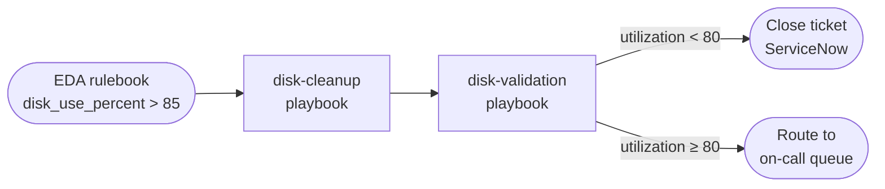
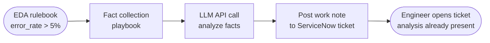
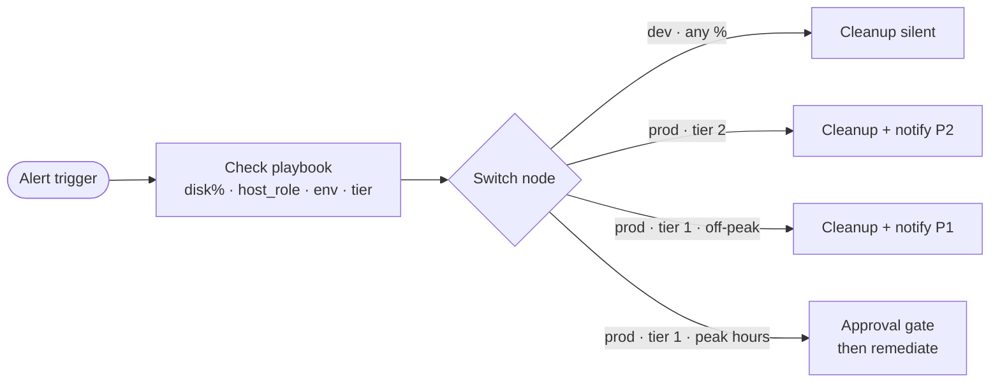
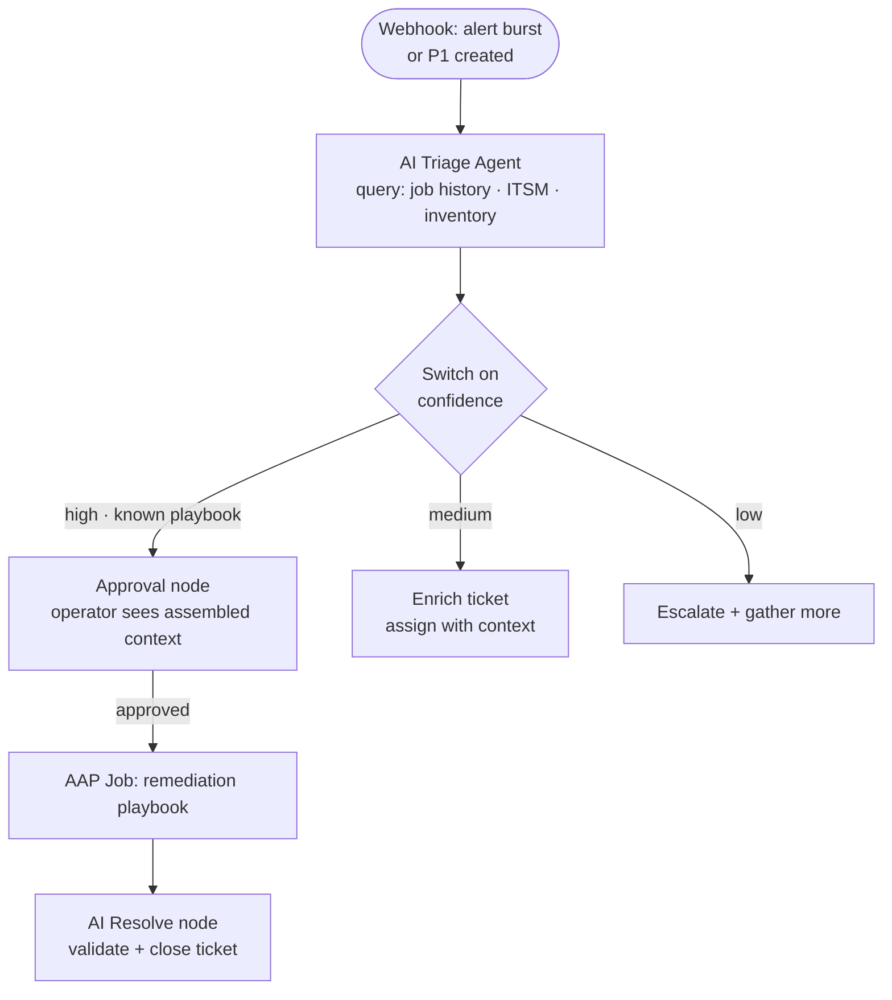
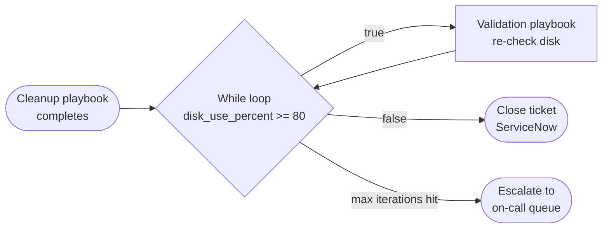


# Ticket Enrichment Automation: From EDA to AI-Driven Orchestration - Automation Journey Guide <!-- omit in toc -->


<style>
  div#toc {
    display: none;
  }
</style>

## Overview

Ticket enrichment is where most operations teams leave time on the floor. The monitoring tool fires. A ticket opens. Someone reads it, gathers context from two or three other systems, decides what to run, and finally kicks off automation that executes in minutes. The execution is not the problem. The investigation before it is.

This guide walks through the ticket enrichment automation journey in six concrete scenarios: what a well-designed **AAP + EDA** setup handles on its own, the signals that tell you when you have outgrown it, and how **Automation Orchestrator (AO)** extends that design when your requirements demand it. Every scenario includes an explicit decision point so you can locate yourself on the journey and know what to build next.

It is written for the engineer who builds and maintains these workflows, not a buyer overview. If you are deciding which node type to use and why, this is for you.

- [Overview](#overview)
- [Background](#background)
- [Solution](#solution)
  - [Who Benefits](#who-benefits)
- [Prerequisites](#prerequisites)
- [The Ticket Enrichment Journey](#the-ticket-enrichment-journey)
  - [Where are you today?](#where-are-you-today)
  - [Stage 1: Known Incident, Known Fix](#stage-1-known-incident-known-fix)
  - [Stage 2: AI-Enriched Tickets with AAP Only](#stage-2-ai-enriched-tickets-with-aap-only)
  - [Stage 3: Context-Aware Routing](#stage-3-context-aware-routing)
  - [Stage 4: AI-Driven Triage for Novel Incidents](#stage-4-ai-driven-triage-for-novel-incidents)
  - [Stage 5: Full Orchestration Workflows](#stage-5-full-orchestration-workflows)
- [Decision Framework: AAP vs Automation Orchestrator](#decision-framework-aap-vs-automation-orchestrator)
- [Reference: Which Node Type for Which Problem](#reference-which-node-type-for-which-problem)
- [Where to Start](#where-to-start)
- [Validation](#validation)
- [Related Guides](#related-guides)

<h2 id="background"></h2>

## Background

Ticket enrichment means attaching enough context to an incident that the response decision becomes fast and low-risk. Without it, a monitoring alert becomes a ticket, the ticket becomes a waiting room, and a person eventually reconstructs the context that was available at alert time.

The four problems that drive teams toward enrichment automation are almost always the same:

**Triage time dominates MTTR.** Once someone decides what playbook to run, AAP runs it in minutes. The 30-45 minutes before that decision represents manual investigation, not a technical bottleneck.

**On-call gets paged for automatable incidents, but the team does not trust automation to act without oversight.** The automation exists. The question is what the human approval surface looks like, not whether automation should be involved at all.

**EDA rulebooks grow into a maintenance problem.** Every new alert type needs a new rule. Every variant of an existing alert type needs another rule. The mapping between alert and response becomes something that lives in one person's head.

**Novel incidents go unhandled.** When an alert matches no existing rule, a ticket opens and sits in a queue. The incident either resolves on its own or escalates while someone works to understand what is happening.

These four problems have different solutions at different points on the automation journey. This guide connects them to specific design patterns.

<h2 id="solution"></h2>

## Solution

The ticket enrichment pattern uses three components, added progressively:

- **Event-Driven Ansible (EDA)** to detect events and trigger automation without polling
- **Ansible Automation Platform (AAP)** to execute remediation playbooks with governance, credential management, and auditability
- **Automation Orchestrator (AO)** to add context-aware routing, human approval gates, retry loops, and AI reasoning to the workflow layer that sits above AAP job execution

Not every team needs all three. Stage 1 needs only EDA and AAP. Later stages add AO capabilities as requirements demand them.

### Who Benefits

| Persona | Challenge | What They Gain |
|---------|-----------|----------------|
| **Platform Engineer** | Writing more rulebook rules every month; on-call for incidents that feel automatable | Enrichment workflows that handle context-dependent responses automatically, with humans approving only what needs approval |
| **Automation Architect** | Fragile one-off integrations between monitoring and ITSM; unclear escalation paths for novel incidents | A progressive architecture with a clear boundary between deterministic automation and AI-assisted reasoning |
| **IT Operations Leader** | MTTR inflated by triage time; repeat incidents; automation exists but is not consistently applied | Measurable reduction in triage time; audit trail from alert through remediation to ticket closure |

<h2 id="prerequisites"></h2>

## Prerequisites

### Ansible Automation Platform

- AAP 2.5 or later
- Event-Driven Ansible controller configured
- Job templates for target remediation playbooks already tested

### Automation Orchestrator

- AO 2.5 or later (required for Stages 2-4)
- AO connected to AAP as an execution target
- MCP tools configured for any external system queries (ITSM, monitoring)

### External Systems

- ITSM platform (ServiceNow in the examples below)
- Monitoring platform capable of webhook output (Splunk, Dynatrace, Instana, or equivalent)

### Featured Ansible Content Collections

- <a target="_blank" href="https://console.redhat.com/ansible/automation-hub/repo/published/servicenow/itsm/">servicenow.itsm</a> - ServiceNow ticket management from playbooks
- <a target="_blank" href="https://console.redhat.com/ansible/automation-hub/repo/published/ansible/eda/">ansible.eda</a> - Event-Driven Ansible rulebook plugins

<h2 id="journey"></h2>

## The Ticket Enrichment Journey

### Where are you today?

Before reading the scenarios, locate yourself on the journey. Pick the statement that best describes your current state:

> **Stage 1:**
>
> I have EDA rulebooks firing playbooks on known alert types. The automation works for repetitive incidents with deterministic fixes.

> **Stage 2:**
>
> I have deterministic automation running. I want to reduce investigation time on incidents that engineers still handle manually. My goal is AI-generated analysis on the ticket before anyone opens it — not automated remediation. I am not ready for a full orchestration platform yet.

> **Stage 3:**
>
> I have AI enrichment on tickets. The rulebooks are growing because the same alert type needs different responses depending on context I cannot encode in a single rule.

> **Stage 4:**
>
> I have context-aware routing in place. My next problem is incidents where no rulebook entry matches and the correct response requires correlating data from multiple systems.

> **Stage 5:**
>
> I have AI-assisted triage for novel incidents. My remaining problems are post-remediation validation and P1 escalations where an on-call engineer needs assembled context in under two minutes.

Each section below starts at one of these points and shows what to build next.

---

### Stage 1: Known Incident, Known Fix

**The ticket:**

```
INC0042817
Priority: P3 | Category: Infrastructure | Assignment: Platform Engineering
Short description: Disk utilization high on app-server-07
Description: Splunk alert fired. disk_use_percent=92 on /dev/sda1.
Host: app-server-07.prod.example.com
```

**The pattern:**

An EDA rulebook watches for Splunk disk alerts. When `disk_use_percent` exceeds 85, it triggers a cleanup playbook, then a validation playbook. If utilization drops below 80, the ticket auto-closes via the `servicenow.itsm` collection. If it does not, the ticket routes to the on-call queue.

This runs 15-20 times per week with no human involvement. It is exactly the scenario EDA and AAP are built for: deterministic alert, known fix, testable outcome.



**When Stage 1 is enough:**

Stage 1 handles high-volume, repetitive incidents well. If the alert type is well understood, the fix is deterministic, and volume is high, stay here. AAP + EDA has lower latency than adding a workflow layer and simpler operational surface.

**The signal you have outgrown Stage 1:**

Tickets that do not match any EDA rule still land in a queue. Engineers spend 20-40 minutes per incident reconstructing context — pulling logs, checking metrics, reading application state — before they can even decide what playbook to run. The automation exists; the investigation before it does not.

---

### Stage 2: AI-Enriched Tickets with AAP Only

**No AO required. No automated remediation. Just AI analysis on the ticket before a human opens it.**

**The ticket:**

```
INC0047291
Priority: P2 | Category: Application | Assignment: Platform Engineering
Short description: Application error rate elevated on web-01
Description: Error rate exceeded 5% threshold. Requires investigation.
Host: web-01.prod.example.com
```

**The current cost:**

An engineer opens the ticket, SSHes into web-01, pulls the last hour of application logs, checks memory and CPU, checks if a deployment ran recently. Reads through the errors. Writes a paragraph in the ticket about what they found. Twenty to forty minutes per incident, every time, for every engineer on rotation.

Nothing about that investigation requires human judgment. All of it requires access to the host and time to read the output.

**The AAP + LLM design:**

EDA triggers on the alert. A playbook runs against the affected host, collects facts and logs, calls an LLM API with those facts as context, and posts the LLM's analysis as a work note on the ServiceNow ticket. By the time an engineer opens the ticket, a structured analysis paragraph is already there.



**The playbook pattern:**

```yaml
- name: Collect application error logs
  ansible.builtin.command:
    cmd: journalctl -u app.service --since "1 hour ago" -p err --no-pager
  register: error_logs

- name: Collect system resource state
  ansible.builtin.gather_facts:

- name: Call LLM for incident analysis
  ansible.builtin.uri:
    url: "{{ llm_api_url }}/v1/chat/completions"
    method: POST
    headers:
      Authorization: "Bearer {{ llm_api_key }}"
      Content-Type: application/json
    body_format: json
    body:
      model: "{{ llm_model }}"
      messages:
        - role: system
          content: >
            You are an infrastructure analyst. Given application logs and system
            metrics, provide: (1) probable root cause, (2) affected component,
            (3) recommended investigation steps. Be concise and specific.
        - role: user
          content: |
            Host: {{ inventory_hostname }}
            Memory used: {{ ansible_memused_mb }}MB / {{ ansible_memtotal_mb }}MB
            CPU load (1m): {{ ansible_loadavg['1m'] }}

            Application error logs (last 1 hour):
            {{ error_logs.stdout | truncate(3000) }}
  register: llm_response

- name: Post AI analysis as work note
  servicenow.itsm.snow_record:
    table: incident
    number: "{{ snow_ticket_number }}"
    other:
      work_notes: |
        [Automated AI Analysis]
        {{ llm_response.json.choices[0].message.content }}
```

**What changed for the engineer:**

They open the ticket and read a paragraph. The log-pulling, the reading, the correlation — it already happened. Their time shifts from 30 minutes of investigation to 5 minutes of reading and deciding. They still own the decision. The AI does not remediate anything. It assembles context.

**LLM options:**

Any OpenAI-compatible API endpoint works with this pattern: <a target="_blank" href="https://www.redhat.com/en/products/ai/red-hat-ai-inference-server">Red Hat AI Inference Server</a> (on-prem, RHEL or OpenShift), Azure OpenAI, or any other provider. Store the API key in AAP credential vault; inject it at runtime via `{{ llm_api_key }}`.

> **Design principle:** AI enrichment without AO
>
> This pattern requires only AAP and an LLM API endpoint. It is the right starting point for teams that want to test AI integration before committing to a full orchestration platform. The signal to advance is when you want the enrichment output to drive automated routing or remediation — that is when AO's switch nodes and AI agent nodes become relevant.

**The signal you have outgrown Stage 2:**

The AI analysis on tickets is useful. Engineers are reading it and acting on it. Now you want the workflow to make a routing decision based on what the analysis found — different playbooks for different root cause categories, or different escalation paths based on severity. That logic cannot live in a playbook; it needs a switch node.

---

### Stage 3: Context-Aware Routing

**The problem:**

Same alert. Same threshold. Same priority assigned by the rulebook.

```
INC0051334 | payments-db-01.prod | disk_use_percent=91 | Time: 23:47 Friday
INC0051401 | dev-sandbox-12.dev  | disk_use_percent=91 | Time: 09:12 Monday
```

One should wake someone up immediately. The other is routine noise. A single rulebook rule cannot make that distinction without duplicating the rule for every combination of host type, environment, and time of day.

**What AO adds: Switch nodes**

A switch node routes on any runtime value: a variable output by a playbook, a field from a ticket, a tag from inventory. It is not a workflow that branches on success or failure. It branches on what the playbook found.

One check playbook runs and outputs `disk_use_percent`, `host_role`, `environment`, and `service_tier`. The switch reads those values and routes:



**What this buys:**

Routing logic lives in one switch node instead of multiplying across rulebook entries. When a new host type gets added to inventory with the right group tags, it routes correctly automatically without a rulebook change. The rulebook stays simple; the context logic lives in the workflow.

> **Design principle:** Switch nodes
>
> Use a switch node when the correct response depends on data that can only be known at execution time. If you are writing more rulebook rules to handle variants of the same alert, that is the signal to move the branching logic into a switch node.

**The signal you have outgrown Stage 3:**

You have an incident that does not match any existing rule. Five alerts fire within ten minutes on related hosts. The incident is the pattern across the alerts, not any individual one. No switch node can route on data that was never collected.

---

### Stage 4: AI-Driven Triage for Novel Incidents

**The ticket:**

```
INC0058902
Priority: P1 | Category: Application | Assignment: Platform Engineering
Short description: Payment service degraded
Description: Multiple alerts triggered within 10 minutes:
  - payments-api-01: response_time_p99=8400ms (threshold: 2000ms)
  - payments-db-01: active_connections=498 (max_pool=500)
  - payments-db-02: replication_lag=47s (threshold: 5s)
  - cache-01: memory_use_percent=97
  - payments-api-02: error_rate=12.4% (threshold: 1%)
No matching runbook found. Assigned to on-call queue.
```

**The current cost:**

On-call gets paged at 23:52. They open their laptop. Check the monitoring platform, check AAP job history, check ITSM for related incidents. Forty-three minutes later they identify the cause: a deployment earlier that day changed a connection pool configuration, and under evening load it started exhausting connections, which cascaded. They run the rollback playbook. Service recovers.

Nothing required 43 minutes of investigation. All the data was available. Nobody had assembled it.

**What AO adds: AI agent nodes and approval nodes**

An AI agent node reasons over context and takes action using tools. Unlike a single LLM API call in a playbook, an agent node can iterate: gather context from one system, assess what it finds, query a second system, then conclude before routing. It does the 40 minutes of correlation that the on-call engineer would have done.

An approval node is a human decision as a first-class workflow step. The operator sees the agent's reasoning, the recommended playbook, and the blast radius, then approves or rejects. The workflow branches on that decision.



**What changed for on-call:**

On-call still got paged. They still made the decision. What changed: they received a paragraph with the answer instead of five raw alerts. Their time shifted from 43 minutes of investigation to 4 minutes of reading and approving.

The agent did not replace the on-call engineer. It did the data gathering and correlation that the engineer would have done anyway, before the engineer was fully awake.

> **Design principle:** AI agent nodes
>
> AI agent nodes are the right tool when the correct response requires assembling context from multiple sources that were not available at workflow-design time. The agent's value is not that it is smarter than a static rulebook; it is that it can query multiple systems mid-reasoning and iterate before concluding, rather than working from a fixed data payload.

---

### Stage 5: Full Orchestration Workflows

Stage 4 covers two scenarios where the full AO toolkit (switch, approval, loop, AI agent) combines into complete workflows.

#### Scenario A: Post-Remediation Validation

**The problem:**

After the disk cleanup playbook from Stage 1 runs, how do you confirm the fix held? A single validation pass can give a false clean: freed space can be partially re-occupied within seconds on a busy host, and log rotation takes time to complete. If you close the ticket on one passing check and the disk refills 90 seconds later, the alert re-fires and the cycle starts over.

**The AO design:**



The while loop evaluates `${disk_use_percent} >= 80` after each validation run. While the condition is true, the validation playbook re-runs. When disk drops below the threshold, the condition breaks and the ticket closes. If max iterations are hit without the condition breaking, the workflow escalates instead.

This gives the cleanup time to take effect before the ticket closes, without a fixed sleep timer in the playbook or someone watching job output.

**For Each variant:**

When an alert sweeps multiple hosts — log cleanup across 20 nodes after a batch job — a For Each loop runs the same validation over each host in the list, aggregates results, and routes: all passing closes the ticket, any failing escalates with a per-host breakdown of which hosts need attention.

> **Design principle:** Loop nodes
>
> Use a while loop when remediation needs time to take effect before validation is meaningful. The condition expression reads from a playbook output variable (`${field} operator value`) and re-runs the loop body until the condition breaks or max iterations are hit. For Each iterates over a collection — use it when the same validation needs to run independently per host or per ticket in a batch.

#### Scenario B: P1 Database Failover at 3am

**The page:**

```
[PagerDuty CRITICAL] payments-db-01 primary unreachable
Host: payments-db-01.prod | Secondary: payments-db-02 (healthy, replication current)
Failover: not triggered | Time: 03:17
```

**Without AO:**

On-call logs in. Checks the monitoring platform, checks replication status, checks AAP job history for anything that might explain the outage, verifies failover is safe (no open transactions, replication lag acceptable). Finds the playbook. Runs it. Back to sleep at 04:01.

**With AO:**

The AI agent queries network path, replication lag, recent AAP jobs against the primary, open transaction count, and secondary load. Forty seconds later it produces:

```
root_cause_hypothesis: Host unreachable; network path healthy → likely host failure
secondary_status: Current, lag=0.3s, load=22%
failover_safe: true
recommended_action: db-failover-prod
confidence: high
```

The approval node sends a push notification at 03:18:

> **Approval notification**
>
> payments-db-01 primary unreachable (host failure, not network). payments-db-02 is current (lag 0.3s) and ready for promotion. Recommended: db-failover-prod. Estimated impact: ~90 seconds connection interruption. Fully reversible when primary recovers.
>
> Approve / Reject

On-call taps Approve at 03:20. Back to sleep at 03:22.

The approval node is not a bureaucratic gate here. It is what makes an on-call engineer comfortable approving a production failover at 3am. They are not blindly trusting automation. They are reading a short paragraph that tells them exactly what the agent found and deciding whether that is enough to act on.

---

## Decision Framework: AAP vs Automation Orchestrator

Use this to locate your requirements:

**AAP + EDA is the right answer when:**

- The alert type is well understood and the fix is deterministic
- The response is the same regardless of which host, environment, or time of day triggered the alert
- Volume is high and per-incident latency matters (AO adds workflow overhead vs. direct EDA trigger)
- You are building initial operator confidence in automation before adding AI nodes

**Add LLM enrichment via AAP playbook when (no AO needed):**

- Engineers spend significant time on repetitive investigation steps before every manual ticket resolution
- Your goal is investigation time reduction, not automated remediation
- You want to test AI integration in a low-risk way before committing to a full orchestration platform
- The enrichment output is informational — a human still reads it and decides what to run

**Add AO switch nodes when:**

- The same alert type needs different responses based on runtime data (host role, environment, service tier, time of day)
- You find yourself adding rulebook rules for variants of the same alert type rather than variants of different alert types
- You want routing logic in one readable place rather than spread across rulebook entries

**Add AO AI agent nodes when:**

- An incident requires correlating data from multiple systems before a response decision can be made
- Novel alert types arrive that have no static rulebook match
- You need to select a remediation playbook dynamically based on what the investigation found

**Add AO approval nodes when:**

- Human sign-off is required but you want the human to have assembled context, not raw alerts
- You want to give on-call engineers a shorter, better-informed path to a decision rather than removing them from the loop

**Add AO loop nodes when:**

- Remediation needs time to take effect before a validation pass is meaningful (while loop on a condition expression read from playbook output)
- The same validation or enrichment step needs to run independently per host or per ticket in a batch (For Each over a list)
- You need a maximum iteration cap to prevent indefinite looping when a genuine failure condition exists

> **Common mistake:**
>
> Reaching for AI nodes on scenarios a switch node handles. If the routing decision is rule-based (disk > 90% escalates), use a switch node. AI nodes add value when the routing decision requires reading context that could not be reduced to a rule.

---

## Reference: Which Node Type for Which Problem

| You need to... | Node type | Notes |
|---|---|---|
| Add AI analysis to a ticket without AO | AAP playbook + `ansible.builtin.uri` | Gather facts on host, POST to LLM API, write work note via `servicenow.itsm` — no AO needed |
| Route on a measured value (disk%, severity, environment) | Switch | Input comes from playbook output variables |
| Route on AI analysis output (confidence, root cause) | Switch on AI agent output | AI agent node runs first; switch reads its output variables |
| Require human sign-off before a risky step | Approval | Operator sees whatever context you pass to the node |
| Validate remediation success with retry tolerance (while condition) | Loop (While) | Condition expression reads playbook output variable; exits when condition breaks or max iterations hit |
| Run the same step independently per host or per ticket in a batch | Loop (For Each) | Iterates over a list; results aggregated for downstream routing |
| Correlate multiple systems before deciding | AI agent | Agent queries systems via MCP tools mid-reasoning |
| Handle an alert with no static rulebook match | AI agent | Agent reasons from symptoms rather than matching rules |
| Select a remediation playbook dynamically | AI agent | Agent reads template descriptions and incident context |
| Process a host list with per-host outcome routing | Loop + Switch | Loop handles batch; switch routes on individual host result |
| Close a ticket with a validated resolution summary | AI agent | Final node validates fix, writes summary, closes ticket |

---

## Where to Start

Do not build Stage 5 first.

**Start with Stage 1.** Pick one high-volume, repetitive alert type. Wire EDA to a cleanup playbook and a validation playbook. Auto-close when passing, route to queue when failing. Build operator confidence in the workflow model before adding complexity.

**Add LLM enrichment next (Stage 2, still no AO).** Pick an incident type where engineers spend 20-40 minutes on the same investigation steps every time. Add a playbook that collects facts and calls an LLM API. Post the analysis as a work note. No routing changes. No remediation changes. Just AI-generated context on the ticket before anyone opens it. Measure how much investigation time drops.

**Add a switch node (Stage 3, first AO step).** Pick an alert type where you have already written multiple rulebook rules for variants of the same problem. Consolidate that routing into a single switch node that reads playbook output. No AI agent nodes yet.

**Add an approval node.** Pick one scenario where a human currently reviews a ticket before taking action. Replace that review with an approval node that gives the operator the LLM analysis alongside the approve/reject prompt.

**Add an AI agent node last (Stage 4).** Pick a scenario where static routing genuinely does not work: a novel incident type, or an incident that requires correlation across sources. Start narrow: one or two MCP tools, a confidence-based switch downstream, approval always required. Expand tool access as confidence builds.

The team that builds in this order ends up with something they trust. The team that starts with the most sophisticated scenario ends up with something nobody uses.

---

## Validation

After wiring any stage of this workflow, verify the end-to-end path before routing real incidents through it.

**Stage 1 validation:**

```bash
# Trigger a test alert manually via the EDA webhook
curl -X POST http://eda-controller.example.com/webhook/disk-alerts \
  -H "Content-Type: application/json" \
  -d '{"host": "test-node-01", "disk_use_percent": 92, "mount": "/dev/sda1"}'
```

Expected: cleanup playbook launches in AAP, validation playbook runs, ServiceNow ticket state changes to "Resolved" within 5 minutes of trigger.

**Stage 2 validation (LLM enrichment):**

Trigger a test alert. Open the ServiceNow ticket and confirm a work note with "Automated AI Analysis" is present within 2 minutes. Check AAP job output to verify the LLM API call returned HTTP 200 and that the `llm_response` variable contains a non-empty `choices[0].message.content`.

**Stage 3 validation (switch routing):**

Run the same trigger with `environment=dev` and with `environment=prod`. Confirm different playbooks launch for each. Check switch node execution history in AO for the actual input values and selected branch.

**Stage 4 validation (AI agent):**

Trigger a test P1 with multiple simultaneous alerts. Confirm the agent produces a structured output with `probable_cause`, `recommended_action`, and `confidence` fields. Confirm the approval notification arrives with those values populated. Confirm the workflow branches correctly on `confidence`.

### Troubleshooting

| Symptom | Likely cause | Check |
|---------|-------------|-------|
| Cleanup playbook launches but ticket does not close | `servicenow.itsm` credential scoping or missing work note write permission | AAP credential vault scope; test ServiceNow API token manually |
| Switch node always takes the default branch | Playbook not setting the expected output variable | Review playbook `set_fact` or `register`; check switch input variable name matches |
| AI agent node times out | MCP tool latency or network path to external system | Check MCP server logs; verify the external system (ITSM, monitoring) is reachable from the AO pod |
| Approval notification not delivered | Push notification config in AO or mobile app not enrolled | Check AO notification provider settings; verify on-call user mobile enrollment |

---

## Related Guides

- [AIOps automation with Ansible](README-AIOps.md) — Crawl/Walk/Run framing for AIOps maturity across EDA, enrichment, and remediation
- [Unlock AIOps with ServiceNow LEAP and Ansible MCP server](README-AIOps-ServiceNow.md) — ServiceNow as the AIOps intelligence layer driving AAP via MCP
- [AIOps with Splunk and Event-Driven Ansible](README-AIOps-Splunk-ITSI.md) — Splunk ITSI integration for predictive and reactive automation

