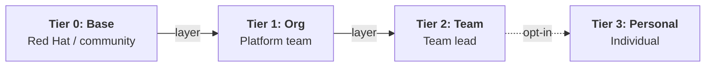

# Ansible Development Workspaces - Solution Guide

## Overview

Enterprise teams need consistent, governed development environments for Ansible automation content. A single monolithic container image either bloats with every team's dependencies or satisfies no one. Different automation domains -- network, Windows, cloud, config-as-code -- each require different system-level packages, and the Ansible DevTools container image has `/var` read-only at runtime by design. Container immutability is a feature, not a limitation: you don't want developers running `dnf install` inside their workspaces, because that creates drift.

This guide demonstrates a **tiered image layering strategy** using standard OpenShift build primitives (ImageStreams and BuildConfigs) to produce customized workspace images for each automation domain without breaking container immutability. When the upstream base image receives a security patch, the entire chain rebuilds automatically -- no manual intervention at any tier.

**Operational Impact:** Low -- creates BuildConfigs and ImageStreams on the cluster. Reversible configuration changes. No production system mutation.

**Business Value Drivers:**

- Reduced onboarding time from weeks to minutes for new automation developers
- Eliminated "works on my machine" failures across distributed teams
- Centralized governance of development toolchains without developer friction

**Technical Value Drivers:**

- Automated image rebuild cascade propagates security patches without manual intervention
- Container immutability enforced by design -- no runtime drift
- Standard OpenShift build primitives (no custom tooling or external CI required)

## Background

[Red Hat OpenShift Dev Spaces](https://access.redhat.com/documentation/en-us/red_hat_openshift_dev_spaces/) provides browser-based VS Code environments running on OpenShift. Each workspace is defined by a `devfile.yaml` checked into the project repository -- when a developer clicks **Create Workspace**, Dev Spaces reads the devfile, provisions the environment, and presents a ready-to-use IDE. Zero local dependencies, zero configuration. For a full introduction to Ansible Development Tools and all installation methods (including Dev Spaces getting started), see the [AI-Assisted Ansible Developer Experience guide](README-Ansible-DevTools.md).

The challenge starts when multiple teams share the same base image but need different system-level packages:

- **Network automation:** `libssh-devel`, `python3-netaddr`, `paramiko`
- **Windows automation:** `krb5-workstation`, `python3-pykerberos`
- **AAP config-as-code:** `httpie`, `python3-pyyaml`
- **Cloud automation:** `awscli`, `python3-boto3`

Because the Ansible DevTools container image has `/var` read-only at runtime, developers cannot `dnf install` additional packages -- and that's correct. Making `/var` writable is an anti-pattern that breaks container immutability and introduces environment drift, the exact problem Dev Spaces solves. Instead, customizations must be baked into the image at build time using standard container layering.
