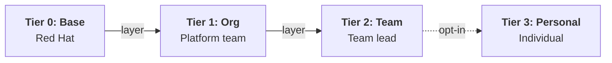
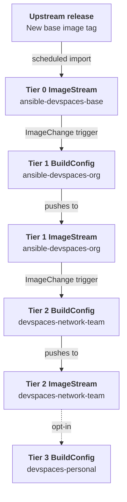

# Ansible Development Workspaces - Solution Guide

## Overview

Enterprise teams need consistent, governed development environments for Ansible automation content. A single monolithic container image either bloats with every team's dependencies or satisfies no one. Different automation domains (network, Windows, cloud, config-as-code) each require different system-level packages, and the Ansible DevTools container image has `/var` read-only at runtime by design. Container immutability is a feature, not a limitation: you don't want developers running `dnf install` inside their workspaces, because that creates drift.

This guide demonstrates a **tiered image layering strategy** using standard OpenShift build primitives (ImageStreams and BuildConfigs) to produce customized workspace images for each automation domain without breaking container immutability. When the upstream base image receives a security patch, the entire chain rebuilds automatically, with no manual intervention at any tier.



**Operational Impact:** Low -- creates BuildConfigs and ImageStreams on the cluster. Reversible configuration changes. No production system mutation.

**Business Value Drivers:**

- Reduced onboarding time from weeks to minutes for new automation developers
- Eliminated "works on my machine" failures across distributed teams
- Centralized governance of development toolchains without developer friction

**Technical Value Drivers:**

- Automated image rebuild cascade propagates security patches without manual intervention
- Container immutability enforced by design, eliminating runtime drift
- Standard OpenShift build primitives (no custom tooling or external CI required)

## Background

[Red Hat OpenShift Dev Spaces](https://access.redhat.com/documentation/en-us/red_hat_openshift_dev_spaces/) provides browser-based VS Code environments running on OpenShift. Each workspace is defined by a `devfile.yaml` checked into the project repository. When a developer clicks **Create Workspace**, Dev Spaces reads the devfile, provisions the environment, and presents a ready-to-use IDE. Zero local dependencies, zero configuration. For a full introduction to Ansible Development Tools and all installation methods (including Dev Spaces getting started), see the [AI-Assisted Ansible Developer Experience guide](README-Ansible-DevTools.md).

The challenge starts when multiple teams share the same base image but need different system-level packages:

- **Network automation:** `libssh-devel`, `python3-netaddr`, `paramiko`
- **Windows automation:** `krb5-workstation`, `python3-pykerberos`
- **AAP config-as-code:** `httpie`, `python3-pyyaml`
- **Cloud automation:** `awscli`, `python3-boto3`

Because the Ansible DevTools container image has `/var` read-only at runtime, developers cannot `dnf install` additional packages, and that's correct. Making `/var` writable is an anti-pattern that breaks container immutability and introduces environment drift, the exact problem Dev Spaces solves. Instead, customizations must be baked into the image at build time using standard container layering.

## Solution

This guide uses a tiered container image strategy to deliver governed development environments. Each tier layers on top of the previous using standard OpenShift build primitives:

- **<a href="https://access.redhat.com/documentation/en-us/red_hat_openshift_dev_spaces/" target="_blank">Red Hat OpenShift Dev Spaces</a>** for browser-based development environments
- **OpenShift BuildConfigs and ImageStreams** for automated image building and tracking
- **Ansible DevTools container image** as the base (Tier 0)
- **Containerfiles** for customization layers at each tier

### Who Benefits

| Persona | Challenge | What They Gain |
|---------|-----------|----------------|
| **Platform Engineer** | Delivering governed environments across multiple automation domains with different system-level dependencies | A repeatable image management pattern using standard OpenShift primitives that auto-rebuilds when upstream updates |
| **Automation Architect** | Standardizing toolchains across teams while allowing domain-specific customization | Tiered image model where standards are inherited automatically, not documented and hoped-for |
| **Team Lead** | Getting team-specific packages into workspaces without waiting on the platform team | Self-service Containerfile in the team repo, auto-built by a BuildConfig with no platform team bottleneck |

### Demos and Self-Paced Labs

- [Ansible Development Tools workshop](<!-- TODO: replace with final RHDP workshop URL -->) -- hands-on DevTools workshop running on Dev Spaces

### Ownership Model

| Concern | Owner | Mechanism |
|---------|-------|-----------|
| Base image version (Tier 0) | Red Hat | External releases |
| Org-wide extra packages (Tier 1) | Platform team | Org-wide BuildConfig (inline Containerfile) |
| Team-specific packages (Tier 2) | Team lead | Containerfile in team workspace repo + BuildConfig |
| Personal extras (Tier 3) | Individual developer | Fork of team repo + personal BuildConfig (opt-in) |

---

## Prerequisites

### OpenShift and Dev Spaces

- **Red Hat OpenShift Container Platform** with the <a href="https://access.redhat.com/documentation/en-us/red_hat_openshift_dev_spaces/" target="_blank">Dev Spaces operator</a> installed and configured
- **`oc` CLI** authenticated to the cluster with permissions to create BuildConfigs and ImageStreams in your target namespace
- Familiarity with Containerfiles (Dockerfiles)

### Ansible DevTools Container Images

The walkthrough uses the Red Hat supported image. A community alternative is available for development and testing without a subscription.

| Variant | Image | Subscription |
|---------|-------|-------------|
| **Supported** | `registry.redhat.io/ansible-automation-platform-27/ansible-devspaces-rhel9` (<a href="https://catalog.redhat.com/en/software/containers/ansible-automation-platform-27/ansible-devspaces-rhel9/69fb1e26580272b336c0ed14" target="_blank">catalog</a>) | AAP or Ansible Developer |
| **Community** | `ghcr.io/ansible/ansible-devspaces` | None |

> **Tip:** These are Dev Spaces images, not dev container images.
>
> The DevTools guide uses `ansible-dev-tools-rhel9` (supported) and `community-ansible-dev-tools` (community) for local dev containers. Those are different images. Do not interchange them.

---

## Image Rebuild Workflow

The tiered strategy uses OpenShift ImageStreams to track upstream image changes and BuildConfig triggers to cascade rebuilds automatically:



When the upstream Ansible DevTools project publishes a new image version, the Tier 0 ImageStream detects the change through scheduled polling (`importPolicy.scheduled: true`). This triggers the Tier 1 BuildConfig, which layers org-wide packages and pushes the result to the Tier 1 ImageStream. The Tier 2 BuildConfig watches the Tier 1 ImageStream and rebuilds the team image automatically. If a developer has opted into a personal layer (Tier 3), that rebuilds as well. The entire cascade completes in minutes with zero manual intervention.

When a BuildConfig itself changes (for example, a team lead adds a new package to their Containerfile and pushes to Git), a `ConfigChange` trigger fires a rebuild of that tier and everything downstream.

The result: security patches from the upstream image propagate to every developer's workspace automatically, and package customizations at any tier trigger only the rebuilds that need to happen.

---

## Maturity Path

| Maturity | What You Do |
|----------|-------------|
| **Crawl** | Use the base image as-is (Tier 0 only) -- no customization, works out of the box for general Ansible development |
| **Walk** | Add a Tier 1 org-wide image with an inline BuildConfig for common packages. Validate the auto-rebuild from Tier 0. This is the minimum viable setup for most organizations |
| **Run** | Add Tier 2 team images layered on the org-wide image. Each automation domain gets its own Containerfile and BuildConfig. Auto-rebuild cascade validated end-to-end |
| **Fly** | For organizations with 5+ domain variants, adopt a CEKit (Container Environment Kit) factory model for Tier 1: generate Containerfiles from YAML definitions, build all variants in parallel via CI, and publish to a shared registry. Add lifecycle automation to clean up stale personal images |

---

## Solution Walkthrough

### Step 1: Import the base image (Tier 0)

**Operational Impact:** Low -- creates read-only tracking resources, no cluster mutation.

Create an ImageStream that tracks the upstream Ansible DevTools image. The `importPolicy.scheduled: true` setting tells OpenShift to poll for new tags periodically and trigger downstream rebuilds when the image changes.

```yaml
apiVersion: image.openshift.io/v1
kind: ImageStream
metadata:
  name: ansible-devspaces-base
spec:
  tags:
    - name: latest
      from:
        kind: DockerImage
        name: registry.redhat.io/ansible-automation-platform-27/ansible-devspaces-rhel9:latest
      importPolicy:
        scheduled: true
      referencePolicy:
        type: Local
```

> **Tip:** Community image alternative.
>
> For development or testing without a subscription, replace the `name` value with `ghcr.io/ansible/ansible-devspaces:latest`.

Apply with `oc apply -f imagestream-base.yaml`.

---

### Step 2: Build the org-wide image (Tier 1)

**Operational Impact:** Low -- builds a new container image in the cluster. Does not affect running workspaces.

Create a BuildConfig with an inline Containerfile that layers org-common packages on top of the base image. The `dockerStrategy.from` field connects the build to the Tier 0 ImageStream, overriding the `FROM` line at build time. Two triggers ensure automatic rebuilds: `ImageChange` fires when the base image updates, and `ConfigChange` fires when the BuildConfig itself is modified.

First, create the output ImageStream:

```yaml
apiVersion: image.openshift.io/v1
kind: ImageStream
metadata:
  name: ansible-devspaces-org
spec: {}
```

Then the BuildConfig:

```yaml
apiVersion: build.openshift.io/v1
kind: BuildConfig
metadata:
  name: ansible-devspaces-org
spec:
  source:
    type: Dockerfile
    dockerfile: |
      FROM ansible-devspaces-base:latest
      USER root
      RUN dnf install -y \
            pinentry-curses \
            jq \
          && dnf clean all
      USER 1000
  strategy:
    type: Docker
    dockerStrategy:
      from:
        kind: ImageStreamTag
        name: ansible-devspaces-base:latest
  output:
    to:
      kind: ImageStreamTag
      name: ansible-devspaces-org:latest
  triggers:
    - type: ImageChange
      imageChange: {}
    - type: ConfigChange
```

Apply both with `oc apply -f imagestream-org.yaml -f buildconfig-org.yaml`. The build starts automatically on creation.

---

### Step 3: Create a team image layer (Tier 2)

**Operational Impact:** Low -- builds a new container image. Does not affect running workspaces.

Each team maintains a Containerfile in their workspace repository. A BuildConfig in the team's namespace layers team-specific packages on top of the org-wide image.

**Team Containerfile** (in the team workspace repo root). The `FROM` line references the ImageStream name -- the BuildConfig's `dockerStrategy.from` field overrides it at build time to resolve through the ImageStream:

```dockerfile
FROM ansible-devspaces-org:latest
USER root
RUN dnf install -y \
      libssh-devel \
      python3-netaddr \
    && dnf clean all
USER 1000
```

**Team BuildConfig:**

```yaml
apiVersion: build.openshift.io/v1
kind: BuildConfig
metadata:
  name: devspaces-network-team
  namespace: ansible-network-devspaces
spec:
  source:
    type: Git
    git:
      uri: https://github.com/myorg/ansible-network-workspace.git
      ref: main
  strategy:
    type: Docker
    dockerStrategy:
      dockerfilePath: Containerfile
      from:
        kind: ImageStreamTag
        namespace: <infra-namespace>
        name: ansible-devspaces-org:latest
  output:
    to:
      kind: ImageStreamTag
      name: devspaces-network-team:latest
  triggers:
    - type: ImageChange
      imageChange: {}
    - type: ConfigChange
```

Replace `<infra-namespace>` with the namespace where the Tier 1 ImageStream lives. The `ImageChange` trigger watches the org-wide image -- when it rebuilds (due to an upstream update or package change), the team image rebuilds automatically.

---

### Step 4: Wire the devfile

**Operational Impact:** None -- configuration change to a file in Git.

Point the team's `devfile.yaml` at the team ImageStream in the OpenShift internal registry. This is the moment where image management meets developer experience: after this step, any developer who opens this repository in Dev Spaces gets the team image automatically. They don't need to know about BuildConfigs or ImageStreams.

```yaml
schemaVersion: 2.2.2
metadata:
  name: ansible-network-workspace
components:
  - name: tooling-container
    container:
      image: image-registry.openshift-image-registry.svc:5000/ansible-network-devspaces/devspaces-network-team:latest
      memoryRequest: 2Gi
      memoryLimit: 4Gi
      cpuRequest: 500m
      cpuLimit: 1000m
```

Commit the devfile to the team workspace repository. Developers log into the Dev Spaces dashboard, paste the repository URL, click **Create & Open**, and start coding with all team-specific packages pre-installed.

---

### Step 5: Personal image layer (Tier 3, opt-in)

**Operational Impact:** Low -- one additional BuildConfig per opted-in developer.

When a developer needs a system package that no one else on the team requires, they can create a personal image layer. The developer forks the team workspace repo, modifies the Containerfile to layer on the team image, and updates the devfile to point at their personal ImageStream.

```dockerfile
FROM devspaces-network-team:latest
USER root
RUN dnf install -y niche-package-xyz && dnf clean all
USER 1000
```

The personal BuildConfig follows the same pattern as Tier 2, with the team image as the base. If the same package shows up in multiple personal layers on the same team, promote it to Tier 2.

> **Tip:** Tier 3 is opt-in, not the standard path.
>
> Most developers will never need a personal layer. For one-off experiments, use nested Podman inside the workspace instead of building a custom image.

---

## Validation

### Test the Rebuild Cascade

Trigger the cascade by adding a harmless package to the Tier 1 BuildConfig. Edit the inline Containerfile to add `tree` (a small, safe package), apply the change, and watch the builds propagate:

```bash
# After editing the Tier 1 BuildConfig inline Containerfile to add 'tree'
oc apply -f buildconfig-org.yaml

# Watch the cascade
oc get builds -w
```

### Expected Result

Tier 1 build completes, then Tier 2 build starts automatically within minutes:

```
NAME                           TYPE     FROM     STATUS     STARTED
ansible-devspaces-org-2        Docker            Running    Just now
ansible-devspaces-org-2        Docker            Complete   3 minutes ago
devspaces-network-team-2       Docker            Running    Just now
devspaces-network-team-2       Docker            Complete   5 minutes ago
```

### Troubleshooting

| Symptom | Likely Cause | Fix |
|---------|-------------|-----|
| Build fails with `dnf` errors | Network policy blocking egress to package repos | Check cluster egress rules and add exceptions for RHEL repos |
| ImageStream not updating | `importPolicy.scheduled` not set to `true` | Update the ImageStream spec, or force an import with `oc import-image ansible-devspaces-base:latest` |
| Tier 2 not rebuilding after Tier 1 update | ImageChange trigger missing or misconfigured | Verify the BuildConfig trigger references the correct ImageStreamTag and namespace |
| Workspace starts but packages missing | Devfile pointing at wrong image or tag | Check the image URL in the devfile matches the team ImageStream in the correct namespace |
| Build times out | Cluster resource constraints | Increase the BuildConfig resource limits or check node capacity |

---

## Related Guides

- [AI-Assisted Ansible Developer Experience](README-Ansible-DevTools.md) -- Ansible Development Tools overview, all installation methods (including Dev Spaces getting started), and MCP server configuration
- [Ansible development workspaces blog](<!-- TODO: replace with final blog 1 URL -->) -- narrative companion covering the business case for governed development environments
- [AI-assisted Ansible development with MCP blog](<!-- TODO: replace with final blog 2 URL -->) -- AI-assisted development with the MCP server in governed workspaces

---

## Sources

- <a href="https://access.redhat.com/documentation/en-us/red_hat_openshift_dev_spaces/" target="_blank">Red Hat OpenShift Dev Spaces documentation</a>
- <a href="https://docs.openshift.com/container-platform/latest/cicd/builds/understanding-buildconfigs.html" target="_blank">OpenShift BuildConfig documentation</a>
- <a href="https://docs.openshift.com/container-platform/latest/openshift_images/image-streams-manage.html" target="_blank">OpenShift ImageStream documentation</a>
- <a href="https://docs.ansible.com/projects/dev-tools/container/" target="_blank">Ansible Development Tools container documentation</a>
- <a href="https://docs.redhat.com/en/documentation/red_hat_ansible_automation_platform/2.7/develop-assembly_workspaces_intro" target="_blank">Ansible Development Workspaces documentation (AAP 2.7)</a>
- <a href="https://catalog.redhat.com/en/software/containers/ansible-automation-platform-27/ansible-devspaces-rhel9/69fb1e26580272b336c0ed14" target="_blank">ansible-devspaces-rhel9 container catalog</a>
- <a href="https://github.com/ansible/ansible-devspaces" target="_blank">ansible-devspaces community image</a>

---

*Copyright 2026 Red Hat, Inc.*
