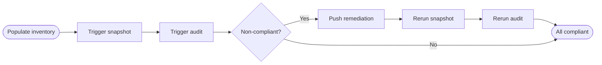
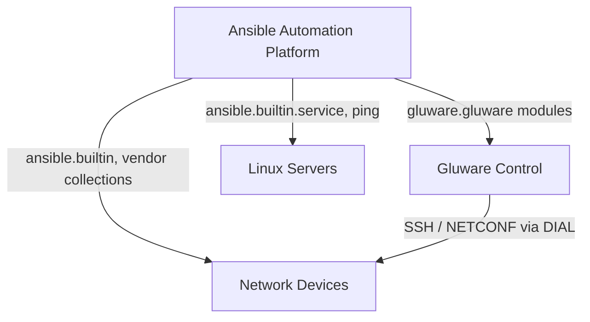


<div class="guide-header">

<h1>Intelligent Network Automation with Gluware and Ansible</h1>

<span class="guide-type-badge guide-type-badge--solution"><i class="fas fa-check-circle" aria-hidden="true"></i> Solution Guide</span>

</div>

<style>
  div#toc {
    display: none;
  }
</style>

> **Work in Progress.**
>
> This guide is a draft reformatted from the Gluware Ansible Certified Collection Solution Guide (v1.0, June 2026). Sections may be incomplete. Partner logos, Arcade demos, and additional validation detail are expected in a future revision.

<div class="guide-hero-callout guide-hero-partner guide-hero-partner--gluware" role="img" aria-label="Ansible Automation Platform and Gluware">
  
  <span class="guide-hero-partner__plus" aria-hidden="true">+</span>
  <span class="guide-hero-partner__partner card-partner-logo-set">
    
    
  </span>
</div>

## Overview

Enterprise network teams manage thousands of devices across dozens of vendors. Configuration drift introduces security and compliance risk. OS upgrade campaigns stretch into weeks of manual effort. Complex deployments like Network Access Control (NAC) break connectivity when partially applied. Each problem demands vendor-specific knowledge that is hard to script and harder to maintain.

**Red Hat Ansible Automation Platform (AAP)** is the automation control plane -- workflow sequencing, approvals, audit trails, and orchestration across the full IT stack. **Gluware** is an intelligent network automation platform with deep, intent-based capabilities for configuration management, OS lifecycle management, and multi-vendor provisioning. The **Gluware Ansible Certified Collection** bridges these two platforms with 14 modules and 2 plugins, letting Ansible playbooks call Gluware operations as native tasks.

This guide demonstrates how to integrate the collection for three high-value network operations use cases:

- **Configuration compliance with remediation** -- continuously audit device configs against policy and automatically remediate drift
- **OS upgrades and validation** -- orchestrate multi-vendor OS upgrades end to end, coordinating network and server dependencies
- **Complex network configuration deployments (NAC)** -- safely deploy complex configs with backup, intent-based provisioning, and post-change verification

## Background

**Ansible Automation Platform** provides a unified framework for automating IT tasks across infrastructure, applications, and networks. Its agentless architecture, rich module ecosystem, and Event-Driven Ansible (EDA) capabilities make it the default choice for enterprise automation orchestration. AAP excels at coordinating multi-system workflows, enforcing execution policies, and providing a governed, auditable automation pipeline.

 <a target="_blank" href="https://www.redhat.com/en/technologies/management/ansible">Ansible Automation Platform -- redhat.com</a>

**Gluware** is an intelligent network automation platform purpose-built for multi-vendor enterprise networks -- both brownfield and greenfield. Key capabilities include:

- **Device Interaction and Automation Layer (DIAL)** -- a multi-vendor semantic translation layer that understands, interprets, and normalizes network-wide intent, device configurations, and operational state across 56+ OS types and 22+ vendors. DIAL provides bi-directional validation to ensure accuracy of intent data modeling, network discovery, and configuration changes.
- **Device Manager** -- multi-vendor network device inventory and source of truth with full device discovery, grouping, and attribute management.
- **Config Drift and Audit** -- automated configuration capture (snapshot), drift detection, and compliance auditing against intent-defined policies.
- **OS Manager (OSM)** -- inventory, planning, and execution of multi-vendor OS upgrades using tested, vendor-validated upgrade workflows.
- **Config Model Editor** -- intent-based network configuration management using structured data models deployed at scale across device groups.
- **Network RPA** -- customizable, drag-and-drop workflow automation to orchestrate Gluware applications and third-party integrations for complex multi-step network operations.
- **GluAPI** -- a comprehensive REST API that enables programmatic integration with external systems, including Ansible.

 <a target="_blank" href="https://gluware.com/ansible">Gluware Ansible Certified Collection -- gluware.com</a>

The **Gluware Ansible Certified Collection** bridges these two platforms. With 14 modules and 2 plugins, it allows Ansible playbooks to directly invoke Gluware operations -- device inventory sync, configuration snapshots, audit execution, OS upgrade workflows, config model deployments, and RPA workflow triggers -- as native Ansible tasks.

## Solution

Ansible Automation Platform acts as the **orchestration layer** while Gluware handles **network-specific intelligence and execution**. This division of labor is intentional:

| Layer | Platform | Responsibilities |
|-------|----------|------------------|
| **Orchestration and control plane** | Red Hat AAP | Workflow sequencing, server operations, non-network tasks, approvals, audit trail |
| **Network intelligence and execution** | Gluware | Device source of truth, config capture, drift audit, OS upgrade, config deployment, RPA workflows, validation powered by DIAL |
| **Integration bridge** | Gluware Ansible Collection | 14 modules + 2 plugins connecting AAP to Gluware's REST API |

### Components

- **Red Hat Ansible Automation Platform 2.5+** -- automation control plane, job templates, workflow orchestration
- **Gluware Control** -- intelligent network automation platform: Device Manager, Config Drift and Audit, OS Manager, Config Modeling, Network RPA
- **Gluware Ansible Certified Collection** -- certified modules and plugins for AAP / Galaxy / Automation Hub
- **Multi-vendor network devices** -- Cisco IOS/IOS-XE/NX-OS, Arista EOS, Juniper JunOS, Aruba, and other Gluware-supported platforms
- **Linux servers** (use cases B and C) -- servers with services dependent on network device availability

### Who Benefits

| Persona | Challenge | What They Gain |
|---------|-----------|---------------|
|  **Network Automation Engineer** | Writing custom scripts to connect Ansible with network-specific operations like config auditing and OS upgrades | A certified, supported integration with ready-to-use modules that call Gluware's full platform from Ansible playbooks |
|  **Network Operations Engineer** | Manually auditing configurations, chasing drift, and running multi-vendor OS upgrades one device at a time | Fully automated compliance-audit-remediate cycles and OS upgrade workflows with pre/post validation |
|  **Automation Architect** | Designing a unified automation pipeline that spans servers and network infrastructure without bespoke glue code | A reference architecture that positions AAP as the control plane and Gluware as the network intelligence layer |
|  **IT Manager / Director** | Compliance risk from configuration drift, long change windows for OS upgrades, and inability to enforce policy at scale | Continuous compliance enforcement, accelerated and validated OS upgrades, and full audit trail from AAP workflows |

## Prerequisites

### Ansible Automation Platform

- **Ansible Automation Platform 2.5+** -- required for enterprise workflow support, dynamic inventory integration, and certified collection access via Automation Hub
- The Gluware Collection should be installed from <a target="_blank" href="https://console.redhat.com/ansible/automation-hub">Red Hat Automation Hub</a> (certified) or <a target="_blank" href="https://galaxy.ansible.com">Ansible Galaxy</a> for development use
- An AAP inventory configured to use the Gluware dynamic inventory plugin, or a static inventory synced from Gluware
- Credentials configured in AAP for Gluware API access (username/password or token-based)

### Featured Ansible Content Collections

| Collection | Type | Purpose |
|-----------|------|---------|
| <a target="_blank" href="https://console.redhat.com/ansible/automation-hub/repo/published/gluware/gluware/">gluware.gluware</a> | Certified | 14 modules for Device Manager, Config Drift and Audit, OS Manager, Config Modeling, and Network RPA; 2 plugins for dynamic inventory and API utilities |
| <a target="_blank" href="https://console.redhat.com/ansible/automation-hub/repo/published/cisco/ios/">cisco.ios</a> | Certified | Cisco IOS/IOS-XE device management -- used for atomic config push in Use Case A |
| <a target="_blank" href="https://console.redhat.com/ansible/automation-hub/repo/published/arista/eos/">arista.eos</a> | Certified | Arista EOS device management -- alternative for Use Case A in Arista environments |
| <a target="_blank" href="https://console.redhat.com/ansible/automation-hub/repo/published/junipernetworks/junos/">junipernetworks.junos</a> | Certified | Juniper JunOS device management -- used in Use Case B OS upgrade validation |
| <a target="_blank" href="https://console.redhat.com/ansible/automation-hub/repo/published/cisco/nxos/">cisco.nxos</a> | Certified | Cisco NX-OS device management -- used in Use Case B OS upgrade validation |
| <a target="_blank" href="https://console.redhat.com/ansible/automation-hub/repo/published/ansible/controller/">ansible.controller</a> | Certified | AAP configuration as code -- job templates, workflows, credentials |

### Gluware platform

The following Gluware components are required. Each maps to specific modules in the Ansible collection:

| Gluware Component | Required For | Key Ansible Modules |
|-------------------|-------------|-------------------|
| **Device Manager** | All use cases | `gluware.gluware.inventory`, `gluware.gluware.device_manager` |
| **Config Drift and Audit** | Use Case A | `gluware.gluware.snapshot`, `gluware.gluware.audit` |
| **OS Manager (OSM)** | Use Case B | `gluware.gluware.osm` |
| **Network RPA** | Use Case B | `gluware.gluware.rpa_workflow` |
| **Config Model Editor** | Use Case C | `gluware.gluware.config_model` |
| **GluAPI** | All use cases | `gluware.gluware.api` |

**Minimum Gluware version:** Gluware Control 5.x or later.

### Network connectivity

- AAP execution nodes must have HTTPS access to the Gluware Control REST API endpoint
- Gluware must have SSH/NETCONF access to managed network devices
- For use cases B and C, Ansible execution nodes need SSH access to Linux servers

## Gluware Network Automation Workflow

The integration follows a consistent pattern across all three use cases: **AAP orchestrates the workflow end to end**, calling Gluware modules for network-specific operations (inventory, snapshots, audits, upgrades, config deployments) and using vendor collections or built-in modules for everything else (remediation push, server services, connectivity checks).

### Use Case A -- Configuration compliance with remediation

Continuously monitor and audit device configurations against policy and automatically remediate drift in a closed-loop **audit-detect-remediate-verify** cycle.



### Use Case B -- OS upgrades and validation

Orchestrate multi-vendor OS upgrades end to end, coordinating server service dependencies with Gluware's proven N-RPA upgrade workflows.


### Use Case C -- Complex configuration deployments (NAC)

Safely deploy complex configurations like Network Access Control with pre-change backup, intent-based provisioning via Config Model, and post-change connectivity verification.


### Architecture overview

All three use cases share the same layered architecture:



## Solution Walkthrough

### Use Case A -- Configuration compliance with remediation

Configuration drift is one of the most persistent challenges in enterprise network operations. Engineers make manual changes during incidents, vendors push updates, and migrations leave inconsistencies. Over time, running configurations diverge from policy -- creating security risk, compliance exposure, and operational unpredictability.

#### A1. Populate inventory from Gluware

The Gluware dynamic inventory plugin queries Gluware's Device Manager via GluAPI and returns all managed devices, their attributes, device groups, and metadata as an Ansible inventory. This makes Gluware the **source of truth** for network device inventory.

```yaml
# inventory.gluware.yml
plugin: gluware.gluware.inventory
gluware_host: "https://gluware.example.com"
gluware_username: "{{ lookup('env', 'GLUWARE_USER') }}"
gluware_password: "{{ lookup('env', 'GLUWARE_PASS') }}"
device_groups:
  - "Campus-Switches"
  - "Data-Center-Core"
```

#### A2. Trigger Gluware configuration snapshot

Ansible invokes the Gluware snapshot module to capture running configurations across the target device group. Gluware connects to each device, retrieves the running config, stores it in its configuration database, and computes drift.

```yaml
- name: Trigger Gluware configuration snapshot
  gluware.gluware.snapshot:
    gluware_host: "{{ gluware_host }}"
    gluware_username: "{{ gluware_username }}"
    gluware_password: "{{ gluware_password }}"
    device_group: "{{ target_device_group }}"
    wait_for_completion: true
    timeout: 300
  register: snapshot_result
```

#### A3. Trigger configuration audit

Ansible triggers the Gluware audit module to run compliance checks against predefined audit policies. The audit result contains a per-device compliance status and specific violations.

```yaml
- name: Trigger Gluware configuration audit
  gluware.gluware.audit:
    gluware_host: "{{ gluware_host }}"
    audit_policy: "{{ audit_policy_name }}"
    device_group: "{{ target_device_group }}"
    wait_for_completion: true
  register: audit_result

- name: Extract non-compliant devices
  ansible.builtin.set_fact:
    non_compliant_devices: >-
      {{ audit_result.results | selectattr('compliant', 'equalto', false) | list }}
```

#### A4. Push remediation to non-compliant devices

For non-compliant devices, Ansible uses the appropriate vendor collection to push targeted remediation configuration derived from the audit violations.

```yaml
- name: Push remediation configuration to non-compliant Cisco IOS devices
  cisco.ios.ios_config:
    lines: "{{ item.remediation_config }}"
    save_when: changed
  loop: "{{ non_compliant_devices | selectattr('os_type', 'equalto', 'ios') | list }}"
  register: remediation_result
```

#### A5. Rerun snapshot and audit

After remediation, Ansible triggers another Gluware snapshot to capture the updated running configurations, then re-runs the same audit policy to verify closure.

```yaml
- name: Trigger post-remediation Gluware snapshot
  gluware.gluware.snapshot:
    gluware_host: "{{ gluware_host }}"
    device_group: "{{ target_device_group }}"
    wait_for_completion: true
    timeout: 300
  register: post_remediation_snapshot
```

#### A6. Assert compliance

The final step confirms all previously non-compliant devices are now compliant -- closed-loop confirmation.

```yaml
- name: Assert all devices are now compliant
  ansible.builtin.assert:
    that:
      - post_remediation_audit.summary.non_compliant == 0
    fail_msg: "Post-remediation audit still shows non-compliant devices."
    success_msg: "All devices are compliant. Remediation cycle complete."
```

---

### Use Case B -- OS upgrades and validation

OS upgrade campaigns are among the most operationally intensive activities for network teams. A multi-vendor environment with hundreds or thousands of devices requires careful image management, pre-upgrade validation, coordinated service impacts, and post-upgrade verification.

#### B1. Populate inventory from Gluware

Same dynamic inventory plugin as Use Case A, scoped to the upgrade wave's device group.

#### B2. Validate current OS version

Before executing any upgrade, Ansible gathers the current OS version from each target device and validates it against the expected pre-upgrade baseline.

```yaml
- name: Validate current OS version is expected pre-upgrade version
  ansible.builtin.assert:
    that:
      - ansible_net_version == expected_pre_upgrade_version
    fail_msg: >-
      {{ inventory_hostname }} is running {{ ansible_net_version }},
      expected {{ expected_pre_upgrade_version }}. Halting.
```

#### B3. Stop dependent services on Linux servers

Before network devices are upgraded and potentially rebooted, Ansible stops dependent application services on Linux servers to prevent application errors during the network disruption.

```yaml
- name: Stop application services dependent on network devices
  ansible.builtin.service:
    name: "{{ item }}"
    state: stopped
  loop: "{{ dependent_services }}"
  delegate_to: "{{ item_server }}"
```

#### B4. Trigger Gluware N-RPA OS upgrade workflow

Ansible triggers a Gluware Network RPA workflow that handles the full multi-vendor OS upgrade process -- image staging, pre-upgrade checks, upgrade execution, and post-upgrade validation.

```yaml
- name: Trigger Gluware N-RPA OS upgrade workflow
  gluware.gluware.rpa_workflow:
    gluware_host: "{{ gluware_host }}"
    workflow_name: "{{ os_upgrade_workflow_name }}"
    device_group: "{{ target_device_group }}"
    workflow_variables:
      target_os_version: "{{ target_os_version }}"
      upgrade_image_path: "{{ upgrade_image_repository }}"
    wait_for_completion: true
    timeout: 7200
  register: rpa_result
```

> **Tip:** Gluware N-RPA workflows.
>
> N-RPA workflows encapsulate vendor-specific OS upgrade procedures -- image copy, MD5 verification, boot statement modification, reload scheduling, and post-reload reachability checks. These workflows are authored and tested in Gluware before being triggered from Ansible.

#### B5. Validate new OS version

After the Gluware RPA workflow completes, Ansible re-queries each device's OS version to confirm the upgrade succeeded.

```yaml
- name: Validate OS upgraded to target version
  ansible.builtin.assert:
    that:
      - ansible_net_version == target_os_version
    success_msg: >-
      {{ inventory_hostname }} successfully upgraded to {{ ansible_net_version }}.
```

#### B6. Start dependent services

With the OS upgrade confirmed, Ansible restarts the application services that were stopped in step B3.

```yaml
- name: Start application services on dependent servers
  ansible.builtin.service:
    name: "{{ item }}"
    state: started
  loop: "{{ dependent_services }}"
  delegate_to: "{{ item_server }}"
```

---

### Use Case C -- Complex configuration deployments (NAC)

Some network configuration changes are complex enough that they cannot be safely handled by a simple config push. Network Access Control (NAC) deployment modifies authentication and authorization behavior on switch ports -- a wrong or partially applied configuration can break network connectivity for hosts.

#### C1. Populate inventory from Gluware

Same dynamic inventory plugin, scoped to access and distribution switches targeted for NAC.

#### C2. Verify pre-change connectivity from Linux hosts

Before any network changes, Ansible verifies that the Linux hosts affected by the NAC deployment are currently reachable, establishing a pre-change baseline.

```yaml
- name: Verify pre-change connectivity from Linux hosts
  ansible.builtin.ping:
  delegate_to: "{{ item }}"
  loop: "{{ linux_hosts_to_verify }}"
  register: pre_change_ping

- name: Assert all Linux hosts are reachable pre-change
  ansible.builtin.assert:
    that:
      - pre_change_ping.results | selectattr('failed', 'equalto', true) | list | length == 0
    fail_msg: "Pre-change connectivity check failed. Resolve before proceeding."
```

#### C3. Trigger Gluware configuration backup

Before making any changes, Ansible triggers a Gluware configuration backup -- creating a restorable snapshot and providing a rollback path.

```yaml
- name: Trigger pre-change configuration backup in Gluware
  gluware.gluware.snapshot:
    gluware_host: "{{ gluware_host }}"
    device_group: "{{ nac_target_device_group }}"
    snapshot_label: "pre-nac-deployment-{{ ansible_date_time.date }}"
    wait_for_completion: true
  register: backup_result
```

#### C4. Deploy NAC configuration via Gluware Config Model

Ansible invokes the Gluware Config Model module to deploy the NAC configuration. Config Model uses intent-based, structured data models to generate and push vendor-correct, consistent configuration across all target devices -- ensuring that complex NAC configuration (802.1X, RADIUS, port authentication, fallback policies) is applied correctly across multi-vendor access switches.

```yaml
- name: Trigger Gluware Config Model deployment for NAC
  gluware.gluware.config_model:
    gluware_host: "{{ gluware_host }}"
    config_model_name: "{{ nac_config_model_name }}"
    device_group: "{{ nac_target_device_group }}"
    model_variables:
      radius_server_primary: "{{ radius_primary }}"
      radius_server_secondary: "{{ radius_secondary }}"
      dot1x_policy: "{{ dot1x_policy_name }}"
    dry_run: false
    wait_for_completion: true
    timeout: 600
  register: config_model_result
```

> **Tip:** Use `dry_run: true` first.
>
> Run a separate pre-flight task with `dry_run: true` to preview the configuration generated by the Config Model before committing. This is especially valuable for complex deployments like NAC.

#### C5. Verify post-change connectivity

After NAC deployment, Ansible re-runs the connectivity verification from the Linux hosts to confirm authenticated hosts can reach the network.

```yaml
- name: Wait briefly for 802.1X authentication to complete
  ansible.builtin.wait_for:
    timeout: 60

- name: Verify post-change connectivity from Linux hosts
  ansible.builtin.ping:
  delegate_to: "{{ item }}"
  loop: "{{ linux_hosts_to_verify }}"
  retries: 5
  delay: 15
  until: post_change_ping is succeeded
  register: post_change_ping
```

## Validation

### Verify integration setup

After completing any of the three use cases, the following steps confirm the end-to-end integration is functioning correctly.

**1. Verify dynamic inventory population:**

```bash
ansible-inventory -i inventory.gluware.yml --list
```

Expected: JSON output containing all devices from the specified Gluware device groups.

**2. Verify Gluware API connectivity:**

```bash
curl -k -u "username:password" https://gluware.example.com/api/v1/devices
```

Expected: HTTP 200 with a JSON array of devices.

**3. Verify collection installation:**

```bash
ansible-galaxy collection list | grep gluware
```

Expected: `gluware.gluware` with the installed version.

### Per-use-case validation

| Use Case | What to Verify | Success Indicator |
|----------|----------------|-------------------|
| **A -- Compliance** | Post-remediation audit shows full compliance | Gluware Config Drift and Audit console shows 100% compliance for the target device group |
| **B -- OS Upgrade** | OS versions match target after upgrade | `ansible_net_version == target_os_version` on all devices; Gluware Device Manager reflects updated OS |
| **C -- NAC** | Host connectivity restored after deployment | All `ansible.builtin.ping` checks pass post-change; authenticated hosts reach the network |

### Troubleshooting

| Symptom | Likely Cause | Fix |
|---------|-------------|-----|
| Dynamic inventory returns empty or partial device list | Credentials misconfigured or device group name mismatch | Verify credentials in AAP; confirm device group name matches exactly in Gluware Device Manager |
| `gluware.gluware.snapshot` times out | Large device group or slow device responses | Increase `timeout` parameter; consider splitting into smaller device groups |
| `gluware.gluware.audit` returns unexpected failures | Audit policy not configured or name mismatch | Verify audit policy name in Gluware Config Drift and Audit; run audit manually in Gluware console first |
| `gluware.gluware.rpa_workflow` fails immediately | Workflow name not found or N-RPA not enabled | Confirm workflow name matches exactly; verify RPA workflow is published in Gluware |
| Post-remediation audit still shows non-compliant devices | Remediation config lines incorrect or device refused change | Review device-level audit detail in Gluware; check AAP job output for config push errors |
| Linux host ping fails post-NAC deployment | 802.1X authentication delay or RADIUS misconfiguration | Increase `wait_for` timeout; verify RADIUS server reachability; initiate rollback if needed |
| AAP cannot reach Gluware API | Network ACL or firewall blocking HTTPS | Confirm HTTPS (TCP 443) is permitted from AAP execution nodes to Gluware Control IP |

## Maturity Path

| Maturity | Capability | Description |
|----------|-----------|-------------|
|  **Crawl** | Dynamic inventory + snapshots | Use Gluware as Ansible's network inventory source of truth. Trigger config snapshots on demand from Ansible. Low risk, immediate value. |
|  **Walk** | Audit-driven reporting | Run compliance audits from Ansible workflows. Export results to ITSM (ServiceNow, Jira). Build visibility before adding remediation. |
|  **Run** | Full closed-loop automation | Remediate drift automatically, trigger OS upgrades from pipelines, deploy complex configs with pre/post validation. EDA can initiate workflows from observability alerts. |
|  **Fly** | AI-augmented network ops | Integrate Gluware's data with Red Hat AI / Automation code assistant for natural-language-driven network operations and AI-generated remediation playbooks. |

> **Tip:** Start at Walk.
>
> Begin with Use Case A at the Walk stage -- use the audit module to generate compliance reports without auto-remediation. Once audit policies are validated and teams trust the results, enable automated remediation for Run.

## Summary

The Gluware Ansible Certified Collection enables enterprise network teams to combine the orchestration power of Red Hat Ansible Automation Platform with the deep, intent-based network automation capabilities of Gluware -- without custom scripting or bespoke API integrations.

The three use cases in this guide represent the highest-value, highest-frequency network operations workflows:

- **Configuration compliance with remediation (Use Case A)** delivers continuous compliance -- automatically capturing config state, auditing against policy, remediating drift, and verifying closure in a closed loop.
- **OS upgrades and validation (Use Case B)** automates the full multi-vendor OS upgrade lifecycle -- coordinating server dependencies, leveraging Gluware's proven upgrade workflows, and verifying success at every step.
- **Complex configuration deployments -- NAC (Use Case C)** enables safe, intent-driven deployment of complex configurations with pre-change backup, structured provisioning via Config Model, and post-change connectivity verification.

Together, these workflows reduce manual toil, improve compliance posture, shrink change windows, and give network and operations teams a consistent, auditable, and scalable automation pipeline.

## Related Guides

- [AIOps automation with Ansible](README-AIOps.html) -- foundational AIOps reference architecture
- [AIOps with Splunk and Event-Driven Ansible](README-AIOps-Splunk-ITSI.html) -- Splunk integration with EDA, including network OSPF scenario
- <a target="_blank" href="https://access.redhat.com/articles/7123366">Network Backup and Configuration</a> -- KB article for network config management
- <a target="_blank" href="https://access.redhat.com/articles/7123361">Network Fact Gathering and Reporting</a> -- KB article for network inventory and reporting
- <a target="_blank" href="https://gluware.com/ansible">Gluware Ansible Certified Collection</a> -- Gluware partner page
- <a target="_blank" href="https://gluware.com/platforms">Gluware Supported Platforms</a> -- vendor and OS coverage

<span class="guide-closing-logo-set">


</span>

