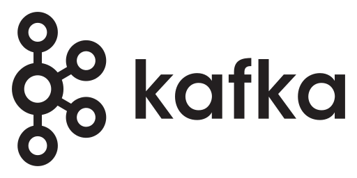
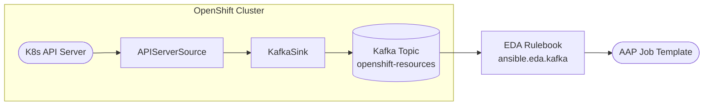


# Using Event-Driven Ansible to Consume OpenShift API Resources With Kafka - Solution Guide <!-- omit in toc -->



<style>
  div#toc {
    display: none;
  }
</style>

## Overview

OpenShift clusters generate continuous API activity -- namespaces are created, workloads are deployed, and configuration changes propagate across the platform. Without a pipeline to capture and surface these changes, operations and automation teams lack real-time visibility into cluster resource lifecycle. Manual approaches such as `oc get <resource> -w` or custom controllers do not scale across clusters or teams.

This guide demonstrates how to build a push-based event pipeline that captures OpenShift API resource changes in real time. **OpenShift Serverless (Knative Eventing)** watches the Kubernetes API server through an **APIServerSource**, routes CloudEvents to a **KafkaSink** backed by **Streams for Apache Kafka**, and **Event-Driven Ansible (EDA)** consumes those messages to trigger automation in **Ansible Automation Platform (AAP)**.

> **This guide builds the foundational event pipeline.**
>
> The walkthrough captures and logs namespace activity as it flows through each stage. For adding automated response actions (applying quotas, enforcing policies, triggering remediation), see the [Maturity Path](#maturity-path) section.

- [Overview](#overview)
- [Background](#background)
- [Solution](#solution)
  - [Who Benefits](#who-benefits)
- [Prerequisites](#prerequisites)
  - [Ansible Automation Platform](#ansible-automation-platform)
  - [OpenShift](#openshift)
  - [Featured Ansible Content Collections](#featured-ansible-content-collections)
  - [External Systems](#external-systems)
- [OpenShift API Event Pipeline Workflow](#openshift-api-event-pipeline-workflow)
  - [Operational Impact per Stage](#operational-impact-per-stage)
  - [CloudEvents Captured](#cloudevents-captured)
- [Solution Walkthrough](#solution-walkthrough)
  - [1. Deploy Kafka with Streams for Apache Kafka](#1-deploy-kafka-with-streams-for-apache-kafka)
  - [2. Install OpenShift Serverless and KnativeKafka](#2-install-openshift-serverless-and-knativekafka)
  - [3. Create Namespace and RBAC for APIServerSource](#3-create-namespace-and-rbac-for-apiserversource)
  - [4. Configure KafkaSink to Publish to Kafka](#4-configure-kafkasink-to-publish-to-kafka)
  - [5. Create APIServerSource to Watch Namespaces](#5-create-apiserversource-to-watch-namespaces)
  - [6. Configure EDA Resources](#6-configure-eda-resources)
  - [7. Configure Automation Controller Resources](#7-configure-automation-controller-resources)
- [Validation](#validation)
  - [Troubleshooting](#troubleshooting)
- [Maturity Path](#maturity-path)
- [Related Guides](#related-guides)
- [Summary](#summary)

<h2 id="background"></h2>

## Background

**Red Hat OpenShift** is the platform where containerized workloads run and where cluster administrators manage shared infrastructure. Understanding what resources are created, modified, and deleted across the cluster is essential for governance, audit, and automated response. **Event-Driven Ansible (EDA)**, a component of Ansible Automation Platform, is designed to react to enterprise events -- but there is no native, supported integration that pulls OpenShift API changes directly into EDA.

Options for integrating these solutions are avilable in the Open Source community that utilize EDA source plugins to poll the OpenShift API, but pull-based monitoring has limitations at scale:

1. Complexity increases as the number of OpenShift clusters grows
2. Events can be missed between poll intervals
3. Long-term supportability is uncertain outside supported product integrations

A supported alternative uses **Knative Eventing** (via **OpenShift Serverless**) to watch the Kubernetes API server and emit **CloudEvents** when resources change. **Apache Kafka**, provided by **Streams for Apache Kafka**, serves as the durable transport layer between Knative and EDA. Kafka adds message durability (events are retained even if EDA is temporarily unavailable), replay capability, and decoupling (multiple consumers can read from the same topic independently).

 <a target="_blank" href="https://www.redhat.com/en/technologies/cloud-computing/openshift">What is Red Hat OpenShift? -- redhat.com</a>

 <a target="_blank" href="https://www.redhat.com/en/technologies/management/ansible/event-driven-ansible">Event-Driven Ansible -- redhat.com</a>

 <a target="_blank" href="https://access.redhat.com/products/streams-apache-kafka/">Streams for Apache Kafka -- redhat.com</a>

 <a target="_blank" href="https://docs.redhat.com/en/documentation/red_hat_openshift_serverless/">OpenShift Serverless -- redhat.com</a>

> **Why Kafka instead of sending CloudEvents directly to EDA?**
>
> APIServerSource can deliver CloudEvents to an HTTP endpoint, but Kafka adds a buffering layer that guarantees message delivery even when EDA is not running. For production environments, this durability is critical -- you do not want to miss a cluster change because EDA was temporarily unavailable.

> **Extensibility:** The APIServerSource `resources` list can watch any Kubernetes API resource (Deployments, ConfigMaps, Routes, and more). This guide uses **Namespaces** to serve as a jumping off point as they are easy to observe and validate. More complex implementations can then reuse the same pattern subsequently.

<h2 id="solution"></h2>

## Solution

What makes up the solution?

-  **Red Hat OpenShift** as the source where API resource changes occur <a target="_blank" href="https://www.redhat.com/en/technologies/cloud-computing/openshift">[Link]</a>
-  **OpenShift Serverless (Knative Eventing)** to watch the API server and emit CloudEvents <a target="_blank" href="https://docs.redhat.com/en/documentation/red_hat_openshift_serverless/">[Link]</a>
-  **Streams for Apache Kafka** as the durable event transport <a target="_blank" href="https://www.redhat.com/en/resources/amq-streams-datasheet">[Link]</a>
-  **Event-Driven Ansible (EDA)** to consume Kafka topics and trigger automation <a target="_blank" href="https://www.redhat.com/en/technologies/management/ansible/event-driven-ansible">[Link]</a>
-  **Ansible Automation Platform (AAP)** for orchestration <a target="_blank" href="https://www.redhat.com/en/technologies/management/ansible">[Link]</a>

### Who Benefits

| Persona | Challenge | What They Gain |
|---------|-----------|---------------|
|  **Platform Engineer / SRE** | No real-time visibility into resource lifecycle across clusters. | Automated capture of namespace events, streamed through Kafka for durability, surfaced in EDA for logging and future automation. |
|  **Automation Architect** | Building custom Kubernetes controllers to react to API changes requires Go expertise and ongoing maintenance. | A reference architecture using supported products -- no custom code required. |
|  **IT Manager / Director** | Lack of audit trail for cluster resource changes. | Every resource change is captured, timestamped, and logged through a durable pipeline with an incremental adoption path. |

<h2 id="prerequisites"></h2>

## Prerequisites

### Ansible Automation Platform

- **Ansible Automation Platform 2.5+** -- Required for Event-Driven Ansible support.

### OpenShift

- **OpenShift Container Platform 4.18+** -- Hosts OpenShift Serverless, Streams for Apache Kafka, and the APIServerSource resources. Ansible Automation Platform may also be hosted in this environment.
- **Cluster-admin access** -- Required to install operators and create cluster level resources.

### Featured Ansible Content Collections

| Collection | Type | Purpose |
|-----------|------|---------|
| <a target="_blank" href="https://console.redhat.com/ansible/automation-hub/repo/published/ansible/eda/">ansible.eda</a> | Certified | EDA event sources and filters (includes `kafka` source plugin) |
| <a target="_blank" href="https://console.redhat.com/ansible/automation-hub/repo/published/ansible/controller/">ansible.controller</a> | Certified | AAP configuration as code (job templates, workflows, surveys) |

### External Systems

| System | Required | Details |
|--------|----------|---------|
| Git repository | Yes | Hosts EDA rulebooks and playbooks |
| Streams for Apache Kafka operator | Yes | Installed via OpenShift OperatorHub |
| OpenShift Serverless operator | Yes | Installed via OpenShift OperatorHub |

**Operational Impact:** Medium -- deploying Kafka and OpenShift Serverless adds new operators and workloads to the cluster. The event pipeline itself is read-only.

<h2 id="openshift-api-event-pipeline-workflow"></h2>

## OpenShift API Event Pipeline Workflow

To demonstrate this pattern, when a Namespace is created, updated, or deleted on the OpenShift cluster, the pipeline captures that change and surfaces it in Ansible Automation Platform:

1. **APIServerSource watches Namespaces** -- Knative Eventing monitors the Kubernetes API server for Namespace resource changes and emits CloudEvents.
2. **KafkaSink publishes to Kafka** -- A KafkaSink routes CloudEvents from the APIServerSource into the `openshift-resources` Kafka topic.
3. **EDA consumes the Kafka topic** -- EDA polls the topic using the `ansible.eda.kafka` source plugin and evaluates rulebook conditions against each event.
4. **AAP logs the activity** -- EDA triggers a job template that prints the namespace event details. This is the foundation for adding real actions later.



The APIServerSource is configured in `Resource` mode, which sends the full Kubernetes resource object in the CloudEvent data payload. This gives EDA access to all namespace metadata for condition matching and logging.

### Operational Impact per Stage

| Stage | Operational Impact | Why |
|-------|-------------------|-----|
| **1. APIServerSource** | **None** | Read-only watch against the K8s API. No changes to the cluster. |
| **2. KafkaSink / Kafka** | **None** | Message transport only. No infrastructure changes after initial deploy. |
| **3. EDA** | **None** | Evaluates events and triggers job templates. No direct changes. |
| **4. AAP Job Template** | **None** | Logs event details. No modifications to any system. |

### CloudEvents Captured

| CloudEvent Type | Trigger | What EDA Receives |
|-----------------|---------|-------------------|
| `dev.knative.apiserver.resource.add` | `oc new-project` or API call | Full Namespace resource JSON (name, labels, annotations, status) |
| `dev.knative.apiserver.resource.update` | Label or annotation change | Updated Namespace resource JSON with modified fields |
| `dev.knative.apiserver.resource.delete` | `oc delete project` or API call | Namespace resource JSON with deletion timestamp |

<h2 id="solution-walkthrough"></h2>

## Solution Walkthrough

### 1. Deploy Kafka with Streams for Apache Kafka

**Operational Impact:** Medium -- deploys a Kafka cluster on OpenShift. Does not affect existing workloads.

An external Kafka instance can be used instead of in-cluster deployment. This guide deploys Kafka on OpenShift for simplicity and reproducibility. Steps for connecting to a remote Kafka instance follow the same KafkaSink and EDA configuration patterns with different bootstrap addresses.

Log in to the OpenShift cluster with elevated access. Create a namespace for Kafka resources:

```yaml
apiVersion: v1
kind: Namespace
metadata:
  name: kafka
```

Install the **Streams for Apache Kafka** operator from **OperatorHub** (search for _Streams for Apache Kafka_, install to the `kafka` namespace, stable channel).

**Kafka listener certificate**

External access requires TLS. Create a TLS secret named `kafka-external-cert` in the `kafka` namespace. You can provide your own certificate or provision one with a tool such as cert-manager:

```shell
oc create secret tls -n kafka kafka-external-cert \
  --cert=path/to/cert/file \
  --key=path/to/key/file
```

**Note:** The Private key must be in PEM or PKCS #12 format

Create `KafkaNodePool` resources for the controller and broker components:

```yaml
apiVersion: kafka.strimzi.io/v1
kind: KafkaNodePool
metadata:
  name: controller
  namespace: kafka
  labels:
    strimzi.io/cluster: cluster
spec:
  replicas: 3
  roles:
    - controller
  storage:
    type: jbod
    volumes:
      - id: 0
        type: persistent-claim
        size: 50Gi
        kraftMetadata: shared
```

```yaml
apiVersion: kafka.strimzi.io/v1
kind: KafkaNodePool
metadata:
  name: broker
  namespace: kafka
  labels:
    strimzi.io/cluster: cluster
spec:
  replicas: 3
  roles:
    - broker
  storage:
    type: jbod
    volumes:
      - id: 0
        type: persistent-claim
        size: 50Gi
        kraftMetadata: shared
```

Create the `Kafka` cluster with internal and external (route) listeners. The external listener uses SCRAM-SHA-512 authentication so the KafkaSink and EDA can connect securely from outside the pod network:

```yaml
apiVersion: kafka.strimzi.io/v1
kind: Kafka
metadata:
  name: cluster
  namespace: kafka
spec:
  kafka:
    version: 4.2.0
    metadataVersion: "4.2"
    authorization:
      type: simple
    listeners:
      - name: plain
        port: 9092
        type: internal
        tls: false
      - name: tls
        port: 9093
        type: internal
        tls: true
      - name: external
        port: 9094
        type: route
        tls: true
        authentication:
          type: scram-sha-512
        configuration:
          brokerCertChainAndKey:
            secretName: kafka-external-cert
            certificate: tls.crt
            key: tls.key
    config:
      offsets.topic.replication.factor: 3
      transaction.state.log.replication.factor: 3
      transaction.state.log.min.isr: 2
      default.replication.factor: 3
      min.insync.replicas: 2
  entityOperator:
    topicOperator: {}
    userOperator: {}
```

> **Note:** Match the `version` and `metadataVersion` fields to the Streams for Apache Kafka version installed on your cluster.

Create the Kafka topic for OpenShift API resources:

```yaml
apiVersion: kafka.strimzi.io/v1
kind: KafkaTopic
metadata:
  name: openshift-resources
  namespace: kafka
  labels:
    strimzi.io/cluster: cluster
spec:
  partitions: 1
  replicas: 1
  config:
    retention.ms: 7200000
    segment.bytes: 1073741824
```

Create two Kafka users with SCRAM-SHA-512 authentication:

- **`openshift`** -- Used by the KafkaSink to publish events (producer)
- **`eda`** -- Used by Event-Driven Ansible to consume events (consumer)

```yaml
apiVersion: kafka.strimzi.io/v1
kind: KafkaUser
metadata:
  name: openshift
  namespace: kafka
  labels:
    strimzi.io/cluster: cluster
spec:
  authentication:
    type: scram-sha-512
  authorization:
    type: simple
    acls:
      - resource:
          type: topic
          name: openshift-resources
          patternType: literal
        operations:
          - Describe
          - Read
          - Create
          - Write
        host: "*"
      - resource:
          type: group
          name: openshift-group
          patternType: literal
        operations:
          - Read
        host: "*"
```

```yaml
apiVersion: kafka.strimzi.io/v1
kind: KafkaUser
metadata:
  name: eda
  namespace: kafka
  labels:
    strimzi.io/cluster: cluster
spec:
  authentication:
    type: scram-sha-512
  authorization:
    type: simple
    acls:
      - resource:
          type: topic
          name: openshift-resources
          patternType: literal
        operations:
          - Describe
          - Read
        host: "*"
      - resource:
          type: group
          name: eda-group
          patternType: literal
        operations:
          - Read
        host: "*"
```

Streams for Apache Kafka (Strimzi) generates credentials in secrets named after each user in the `kafka` namespace. The password can be obtained using the following command:

```bash
oc extract -n kafka secret/<username> --keys=password --to=-
```

### 2. Install OpenShift Serverless and KnativeKafka

**Operational Impact:** Medium -- installs the Serverless Operator and enables Knative Eventing.

Install the **Red Hat OpenShift Serverless** operator from **OperatorHub** (stable channel, default settings).

Deploy Knative Eventing:

```yaml
apiVersion: operator.knative.dev/v1beta1
kind: KnativeEventing
metadata:
  name: knative-eventing
  namespace: knative-eventing
```

Verify Knative Eventing is ready:

```bash
oc get knativeeventing knative-eventing -n knative-eventing
```

Enable the KnativeKafka component with the **sink** capability (required for KafkaSink):

```yaml
apiVersion: operator.serverless.openshift.io/v1alpha1
kind: KnativeKafka
metadata:
  name: knative-kafka
  namespace: knative-eventing
spec:
  broker:
    enabled: false
  channel:
    enabled: false
  sink:
    enabled: true
  source:
    enabled: false
```

Verify the KnativeKafka resource reports ready before proceeding.

```bash
oc get knativekafka knative-kafka -n knative-eventing
```

### 3. Create Namespace and RBAC for the OpenShift Serverless and Supporting Components

**Operational Impact:** None -- read-only RBAC configuration will be created.

Create the namespace that holds the event pipeline resources:

```yaml
apiVersion: v1
kind: Namespace
metadata:
  name: eda-kafka
```

The APIServerSource needs a ServiceAccount with permission to watch Namespace resources:

```yaml
apiVersion: v1
kind: ServiceAccount
metadata:
  name: namespace-watcher-sa
  namespace: eda-kafka
---
apiVersion: rbac.authorization.k8s.io/v1
kind: ClusterRole
metadata:
  name: namespace-watcher
rules:
  - apiGroups: [""]
    resources: ["namespaces"]
    verbs: ["get", "list", "watch"]
---
apiVersion: rbac.authorization.k8s.io/v1
kind: ClusterRoleBinding
metadata:
  name: namespace-watcher-binding
subjects:
  - kind: ServiceAccount
    name: namespace-watcher-sa
    namespace: eda-kafka
roleRef:
  kind: ClusterRole
  name: namespace-watcher
  apiGroup: rbac.authorization.k8s.io
```

> **RBAC:** Scope permissions tightly.
>
> The ClusterRole above only grants `get`, `list`, and `watch` on Namespace resources -- the minimum required for APIServerSource. Do not use the broad `view` or `edit` ClusterRoles. Use a dedicated ServiceAccount for each APIServerSource.

### 4. Configure KafkaSink to Publish to Kafka

**Operational Impact:** None -- creates a routing configuration.

The KafkaSink connects Knative Eventing to the Kafka topic. Create an authentication secret for the `openshift` Kafka user. Extract the username and password from the Strimzi-generated secret and create a secret in the `eda-kafka` namespace that the KafkaSink expects:

```bash
# Extract credentials from the Strimzi openshift user secret
KAFKA_USERNAME=$(oc get kafkauser openshift -n kafka -o jsonpath='{.status.username}')
KAFKA_PASSWORD=$(oc get secret $(oc get kafkauser openshift -n kafka -o jsonpath='{.status.secret}') -n kafka -o jsonpath='{.data.password}' | base64 -d)

# Create the KafkaSink auth secret (format required by Knative KafkaSink)
oc create secret generic openshift-resources-auth -n eda-kafka \
  --from-literal=user="$KAFKA_USERNAME" \
  --from-literal=password="$KAFKA_PASSWORD" \
  --from-literal=sasl.mechanism="SCRAM-SHA-512" \
  --from-literal=protocol="SASL_SSL" 
```

Alternatively, the External Secret Operator (ESO) can be used to automatically synchronize the Secret between namespaces which simplifies how the credentials are managed.

Create the KafkaSink by referencing the Kafka bootstrap servers and the authentication credential created previously

```shell
oc apply -f - <<EOF
apiVersion: eventing.knative.dev/v1alpha1
kind: KafkaSink
metadata:
  name: openshift-resources
  namespace: eda-kafka
spec:
  auth:
    secret:
      ref:
        name: openshift-resources-auth
  bootstrapServers:
    - $(oc get kafka cluster -n kafka -o jsonpath='{.status.listeners[?(@.name=="external")].bootstrapServers}')
  contentMode: structured
  topic: openshift-resources
EOF
```

Verify the KafkaSink is ready:

```bash
oc get kafkasink openshift-resources -n eda-kafka
```

The `READY` column should show `True`.

### 5. Create APIServerSource to Watch Namespaces

**Operational Impact:** None -- read-only watch against the Kubernetes API server.

Create the APIServerSource that specifies the OpenShift resources to monitor and the destination that the resources should be sent to (KafkaSink):

```yaml
apiVersion: sources.knative.dev/v1
kind: ApiServerSource
metadata:
  name: namespace-watcher
  namespace: eda-kafka
spec:
  serviceAccountName: namespace-watcher-sa
  mode: Resource
  resources:
    - apiVersion: v1
      kind: Namespace
  sink:
    ref:
      apiVersion: eventing.knative.dev/v1alpha1
      kind: KafkaSink
      name: openshift-resources
```

Verify the APIServerSource is ready:

```bash
oc get apiserversource namespace-watcher -n eda-kafka
```

The `READY` column should show `True` and `SINK` should be populated. At this point, any Namespace change on the cluster produces a CloudEvent message in the `openshift-resources` Kafka topic.

> **Why direct KafkaSink?**
>
> Routing APIServerSource directly to a KafkaSink is the simplest topology for a single event source. Fewer custom resources means fewer components to troubleshoot.

> **Alternative: KafkaChannel + Subscription path**
>
> Instead of sinking directly to a KafkaSink, you can alternatively route events through a Knative **KafkaChannel** and **Subscription**. This adds an intermediate buffering layer inside Knative Eventing before events reach the external Kafka topic.
>
> | Path | Strengths | Limitations |
> |------|-----------|-------------|
> | **Direct KafkaSink** (this guide) | Fewer CRs, easier to reason about, ideal for single-source pipelines | Less fan-out; harder to add multiple subscribers later |
> | **KafkaChannel + Subscription** | Knative-native buffering, fan-out to multiple sinks, server-side filtering via Triggers | Extra moving parts; requires KnativeKafka channel backend enabled; more CRs to troubleshoot |
>
> To use the channel path, a separate Kafka cluster can be used to manage channel specific messages. This cluster is intended for only intra cluster use and may not need to have an external Route or authentication enabled.
>
> Update the KnativeKafka resource to enable the `channel` component along with the location of the bootstrap server.
>
> ```yaml
> apiVersion: operator.serverless.openshift.io/v1alpha1
> kind: KnativeKafka
> metadata:
>   name: knative-kafka
>   namespace: knative-eventing
> spec:
> channel:
>   bootstrapServers: '<bootstrap_server>'
>   enabled: true
> ...
>```
>
> If authentication is enabled, be sure to configure the authentication details for the broker within a `Secret` using the `authSecretName` and `authSecretNamespace`. 
>
> Create a KafkaChannel and Subscription, then point the APIServerSource sink at the channel instead of the KafkaSink:
>
> ```yaml
> apiVersion: messaging.knative.dev/v1beta1
> kind: KafkaChannel
> metadata:
>   name: openshift-api-events
>   namespace: eda-kafka
> spec:
>   numPartitions: 3
>   replicationFactor: 1
> ```
>
> ```yaml
> apiVersion: messaging.knative.dev/v1
> kind: Subscription
> metadata:
>   name: openshift-resources
>   namespace: eda-kafka
> spec:
>   channel:
>     apiVersion: messaging.knative.dev/v1beta1
>     kind: KafkaChannel
>     name: openshift-api-events
>   subscriber:
>     ref:
>       apiVersion: eventing.knative.dev/v1alpha1
>       kind: KafkaSink
>       name: openshift-resources
> ```
>
> With this path, change the APIServerSource `sink.ref` to point at the KafkaChannel instead of the KafkaSink.

### 6. Configure EDA Resources

**Operational Impact:** None -- EDA is a read-only consumer of the Kafka topic.

Because EDA may run outside the OpenShift cluster, configure it to connect to Kafka via the external route with SCRAM-SHA-512 authentication. Store the credentials to connect with Kafka in AAP. As the credential requires parameters specific for the connection with Kafka, a custom credential type will be created instead of hardcoding the properties in the rulebook.

**Create the AAP custom credential type**

In Ansible Automation Platform, navigate to **Automation Decisions** -> **Infrastructure** -> **Credential Types** -> **Create Credential Type**.

Enter `Kafka` as the _Name_ and use the following field and injector configurations:

```yaml
fields:
  - id: host
    type: string
    label: Host
  - id: port
    type: string
    label: Port
    default: '9092'
  - id: encoding
    type: string
    label: Encoding
  - id: cafile
    type: string
    label: CA File
    multiline: true
  - id: certfile
    type: string
    label: Certificate File
    multiline: true
  - id: keyfile
    type: string
    label: Key File
    secret: true
    multiline: true
  - id: topic
    type: string
    label: Topic
  - id: group_id
    type: string
    label: Group ID
  - id: offset
    type: string
    label: Offset
  - id: security_protocol
    type: string
    label: Security Protocol
  - id: sasl_mechanism
    type: string
    label: SASL Mechanism
  - id: sasl_username
    type: string
    label: SASL Username
  - id: sasl_password
    type: string
    label: SASL Password
    secret: true
  - id: check_hostname
    type: boolean
    label: Check Hostname
  - id: verify_mode
    type: string
    label: Verify Mode
  - id: feedback
    type: boolean
    label: Feedback
required:
  - host
  - topic
  - group_id
```

```yaml
file:
  template.cafile: '{{ cafile }}'
  template.keyfile: '{{ keyfile }}'
  template.certfile: '{{ certfile }}'
extra_vars:
  host: '{{ host }}'
  port: '{{ port }}'
  topic: '{{ topic }}'
  offset: '{{ offset }}'
  encoding: '{{ encoding }}'
  feedback: '{{ feedback }}'
  group_id: '{{ group_id }}'
  verify_mode: '{{ verify_mode }}'
  sasl_password: '{{ sasl_password }}'
  sasl_username: '{{ sasl_username }}'
  check_hostname: '{{ check_hostname }}'
  sasl_mechanism: '{{ sasl_mechanism }}'
  security_protocol: '{{ security_protocol }}'
```
**Create Kafka Credential**

Create a new credential using the Kafka custom credential created previously that represents how EDA will connect to Kafka.

Navigate to **Automation Decisions** -> **Infrastructure** -> **Credential** -> **Create Credential**.

 Enter the following in the Create Credential page:

| Field | Value |
|-------|-------|
| **Name** | `Kafka Cluster` |
| **Organization** | `Default` |
| **Credential Type** | `Kafka` |
| **Host** | `<bootstrap_host>` |
| **Port** | `443` |
| **Topic** | `openshift-resources` |
| **Group ID** | `eda-group` |
| **SASL Protocol** | `SASL_SSL` |
| **SASL Mechanism** | `SCRAM-SHA-512` |
| **SASL Username** | `<eda_username>` |
| **SASL Password** | `<eda_password>` |

Replace the placeholders with the values associated with the Kafka cluster and associated EDA user.

**Create the EDA rulebook**

Create an Ansible Rulebook called `openshift-namespace-events.yml` in your Git repository to capture events from OpenShift stored in Kafka and trigger a Job Template in Ansible Automation Platform.

```yaml
---
- name: Read OpenShift Resources from from Kafka topic
  hosts: all
  sources:
    - name: kafka
      ansible.eda.kafka:
        host: "{{ host | default('localhost', true) }}"
        port: "{{ port | default('9092', true) }}"
        cafile: "{{ eda.filename.cafile | default(None, true) }}"
        certfile: "{{ eda.filename.certfile | default(None, true) }}"
        keyfile: "{{ eda.filename.keyfile | default(None, true) }}"
        encoding: "{{ encoding | default('utf-8', true) }}"
        topic: "{{ topic | default('openshift-resources', true) }}"
        group_id: "{{ group_id | default('openshift-group', true) }}"
        offset: "{{ offset | default('earliest', true) }}"
        security_protocol: "{{ security_protocol | default('PLAINTEXT', true) }}"
        sasl_mechanism: "{{ sasl_mechanism | default('PLAIN', true) }}"
        sasl_plain_username: "{{ sasl_username | default(None, true) }}"
        sasl_plain_password: "{{ sasl_password | default(None, true) }}"
        check_hostname: "{{ check_hostname | default(None, true) }}"
        verify_mode: "{{ verify_mode | default('CERT_NONE', true) }}"

  rules:
    - name: Namespace created
      condition: event.body.type is defined and event.body.type == "dev.knative.apiserver.resource.add"
      action:
        run_job_template:
          organization: "Default"
          name: "Log Namespace Activity"
          job_args:
            extra_vars:
              event_type: "created"
              namespace_name: "{{ event.body.data.metadata.name }}"
              namespace_labels: "{{ event.body.data.metadata.labels | default({}) }}"

    - name: Namespace updated
      condition: event.body.type is defined and event.body.type == "dev.knative.apiserver.resource.update"
      action:
        run_job_template:
          organization: "Default"
          name: "Log Namespace Activity"
          job_args:
            extra_vars:
              event_type: "updated"
              namespace_name: "{{ event.body.data.metadata.name }}"
              namespace_labels: "{{ event.body.data.metadata.labels | default({}) }}"

    - name: Namespace deleted
      condition: event.body.type is defined and event.body.type == "dev.knative.apiserver.resource.delete"
      action:
        run_job_template:
          organization: "Default"
          name: "Log Namespace Activity"
          job_args:
            extra_vars:
              event_type: "deleted"
              namespace_name: "{{ event.body.data.metadata.name }}"

    - name: Log all namespace events
      condition: event.body is defined
      action:
        debug:
          msg: "Namespace event received: {{ event.body.type }} - {{ event.body.data.metadata.name | default('unknown') }}"
```

**Create EDA Project**

Create an EDA project associated with the rulebook created previously and stored in the git repository.

Navigate to **Automation Decisions** -> **Projects** -> **Create Project**. Use the following in the creation form:

| Field | Value |
|-------|-------|
| **Name** | `Ansible Solution Guides` |
| **Organization** | `Default` |
| **Source control type** | `Git` |
| **Source control URL** | `<git_repository_url>` |
| **Source control branch/tag/commit** | `<git_ref>` |

Utilize any of the form fields as appropriate for your git repository.

**Create API Token for EDA Authentication to Automation Controller**

In order to invoke automation (Job Templates) defined in AAP, create a new _Credential_ to enable EDA to authenticate with Automation controller.

Navigate to **Access Management** -> **API Tokens** -> **Create API Token**. Use the following in the creation form:

| Field | Value |
|-------|-------|
| **Name** | `EDA` |
| **Scope** | `Write` |

The generated token will be displayed. Take note of the value as it will be used in the next step.

**Create EDA Credential for Automation Controller**

With an API Token now created, create an EDA to authenticate to Automation Controller.

Navigate to **Automation Decisions** -> **Infrastructure** -> **Credentials** -> **Create Credential**:

| Field | Value |
|-------|-------|
| **Name** | `Automation Controller` |
| **Organization** | `Default` |
| **Credential Type** | `Red Hat Ansible Automation Platform` |
| **Red Hat Ansible Automation Platform** | `https://<gateway_host>/api/controller/` |
| **OAuth Token** | Value of the API token created previously |

**Create Decision Environment**

Create a Decision Environment that utilizes the supported Ansible Automation Platform Decision Environment.

Navigate to **Automation Decisions** -> **Decision Environments** -> **Create decision environment**. Use the following in the creation form:

| Field | Value |
|-------|-------|
| **Name** | `Supported DE` |
| **Image** | `registry.redhat.io/ansible-automation-platform-26/de-supported-rhel9:latest` |

**EDA Rulebook Activation configuration:**

Create an EDA Rulebook Activation to define monitoring the Kafka topic.

Navigate to **Automation Decisions** -> **Rulebook Activations** -> **Create rulebook activation**. Use the following in the creation form:

| Field | Value |
|-------|-------|
| **Name** | `OpenShift Namespace Events` |
| **Project** | `Ansible Solution Guides` |
| **Rulebook** | `openshift-namespace-events.yml` |
| **Decision Environment** | `Supported DE` |
| **Credentials** | <ul><li>`Kafka Cluster \| Kafka`</li><li>`Automation Controller \| Red Hat Ansible Automation Platform`</li></ul> |
| **Offset** | `earliest` |
| **Restart Policy** | `Always` |
| **Rulebook activation enabled?** | Checked |

Once the Rulebook Activation has been created, it will be started. The state of the Rulebook Activation can be seen on the _History_ tab. By selecting the running Rulebook Activation from the History tab, the logs can be viewed. The Rulebook Activation is functioning properly if the following message is displayed:

```
Job activation-job-1-1 is running
```

### 7. Configure Automation Controller Resources

**Operational Impact:** None -- the playbook only prints event details.

**Create Automation Playbook**

Create an Ansible playbook that will be triggered from a Job Template whenever an Event is consumed by EDA. Save the following as `playbooks/log_namespace_activity.yml` in your Git repository:

```yaml
---
- name: Log OpenShift namespace activity
  hosts: localhost
  gather_facts: false

  tasks:
    - name: Display namespace event details
      ansible.builtin.debug:
        msg: |
          Namespace Event Detected
          ========================
          Event Type: {{ event_type }}
          Namespace:  {{ namespace_name }}
          Labels:     {{ namespace_labels | default('N/A') }}
```

**Create Inventory**

Since the playbook created in the previous section executes locally, create an inventory that targets `localhost`.

Navigate to **Automation Execution** -> **Infrastructures** -> **Inventories** . Click the **Create Inventory** dropdown -> **Create Inventory**.

Enter the following in the _Create Inventory_ form:

| Field | Value |
|-------|-------|
| **Name** | `localhost` |
| **Organization** | `Default` |

Create a `localhost` host on the _Hosts_ tab.

**Create Automation Project**

To make use of the newly created playbook, create a Project in Automation Controller.

Navigate to **Automation Execution** -> **Projects** -> **Create project**. Utilize the same parameters that were used when creating the _Ansible Solution Guides_ EDA project as the content will originate from the same source.

**Job Template configuration:**

Create a Job Template to define the target for what automation should be executed when a Namespace event is received.

Navigate to **Automation Execution** -> **Templates**. Click the **Create template** dropdown -> **Create job template**.

Enter the following into the create job template form:

| Field | Value |
|-------|-------|
| **Name** | `Display OpenShift Namespace Event` |
| **Job type** | `Run` |
| **Inventory** | `localhost` |
| **Project** | `Ansible Solution Guides` |
| **Playbook** | `playbooks/log_namespace_activity.yml` |
| **Extra Variables** | Prompt on Launch: `checked` |

At this point, the steps for establishing an OpenShift API event pipeline is complete.

<h2 id="validation"></h2>

## Validation

Validate each stage of the pipeline independently:

| Stage | What to Verify | How to Test | Success Indicator |
|-------|---------------|-------------|-------------------|
| **Kafka** | Kafka cluster is healthy | `oc get kafka cluster -n kafka` | `READY` is `True` |
| **KafkaTopic** | Topic exists | `oc get kafkatopic openshift-resources -n kafka` | `READY` is `True` |
| **APIServerSource** | Source is watching Namespaces | `oc get apiserversource namespace-watcher -n eda-kafka` | `READY` is `True`, `SINKURI` is populated |
| **KafkaSink** | Sink is routing to Kafka | `oc get kafkasink openshift-resources -n eda-kafka` | `READY` is `True` |
| **EDA** | Rulebook activation is running | Check EDA Controller UI | Activation shows **Running** |
| **Automation Controller** | Job template fires on event | Create a test namespace (see below) | Job appears in AAP with correct extra_vars |

### Test

Create a test namespace to trigger the full pipeline:

```bash
oc new-project test-eda-namespace
```

Verify the pipeline fires:

1. Check the EDA Controller -- the rulebook activation event log should show a received event with type `dev.knative.apiserver.resource.add`.
2. Check Automation Controller -- a `Log Namespace Activity` job should appear with `event_type: created` and `namespace_name: test-eda-namespace`.

Clean up and verify the deletion event:

```bash
oc delete project test-eda-namespace
```

A second job should appear in AAP with `event_type: deleted`.

### Expected Result

EDA activation log (abbreviated):

```
INFO     Namespace event received: dev.knative.apiserver.resource.add - test-eda-namespace
```

AAP job extra variables:

```
event_type: created
namespace_name: test-eda-namespace
```

Playbook output:

```
TASK [Display namespace event details] *****************************************
ok: [localhost] => {
    "msg": "Namespace Event Detected\n========================\nEvent Type: created\nNamespace:  test-eda-namespace\n"
}

PLAY RECAP *********************************************************************
localhost                  : ok=1    changed=0    unreachable=0    failed=0    skipped=0
```

### Troubleshooting

| Symptom | Likely Cause | Fix |
|---------|-------------|-----|
| APIServerSource shows `READY=False` | ServiceAccount lacks RBAC permissions | Verify the ClusterRole grants `get`, `list`, `watch` on `namespaces` and the ClusterRoleBinding references the correct ServiceAccount and namespace. |
| APIServerSource is `READY` but no messages in Kafka topic | KafkaSink not ready or misconfigured | Run `oc describe kafkasink openshift-resources -n eda-kafka` and verify `bootstrapServers` and auth secret |
| KafkaSink auth failure | SCRAM credentials mismatch | Recreate `openshift-resources-auth` secret from the Strimzi `openshift` user secret |
| Messages in Kafka but EDA does not fire | `host`, `topic`, or `group_id` mismatch | Verify credential extra vars match the external bootstrap address, topic `openshift-resources`, and group `eda-group` |
| EDA auth failure on startup | Wrong security protocol or CA (if defined) | Set `security_protocol` to `SASL_SSL`, `sasl_mechanism` to `SCRAM-SHA-512`, and provide the cluster CA in `cafile` |
| EDA receives events but no job launches | API token for Ansible Controller is not valid | Confirm the Ansible Automation Platform API token is valid and/or recreate the API token |
| KnativeKafka sink not ready | Sink capability not enabled | Verify `spec.sink.enabled: true` in the KnativeKafka CR |

<h2 id="maturity-path"></h2>

## Maturity Path

| Maturity | Description | Automation Level |
|----------|-------------|-----------------|
| **Crawl** | **Event Visibility** -- Capture namespace lifecycle events into Kafka and EDA. Log event details for audit and visibility. **This is what this guide demonstrates.** | Read-only: events are captured and logged |
| **Walk** | **Automated Governance** -- Extend the pipeline to apply standard configuration to new namespaces (resource quotas, network policies, RBAC bindings, required labels). | Semi-automated: EDA triggers pre-approved configuration playbooks |
| **Run** | **Autonomous Operations** -- Integrate with the AIOps pipeline for AI-driven policy evaluation, dynamic response selection, and fully autonomous namespace governance across multiple clusters. | Fully automated: AI-driven policy enforcement |

> **Ready for AI-driven operations?**
>
> The **Run** stage integrates this event pipeline with the AIOps reference architecture. The Kafka topic from this guide becomes the event source for the AIOps Enrichment Workflow. See [AIOps automation with Ansible](README-AIOps.md) for the full self-healing pipeline.

<h2 id="related-guides"></h2>

## Related Guides

- **Full AIOps reference architecture:** See [AIOps automation with Ansible](README-AIOps.md) for the complete self-healing pipeline with AI inference, Lightspeed playbook generation, and Kafka event consumption.
- **Alternative event transport:** See [AIOps with AWS SQS and Event-Driven Ansible](README-SQS.md) for using AWS SQS instead of Kafka as the message queue.
- **Another EDA pattern:** See [Event-Driven Network Configuration with NetBox and Ansible Automation Platform](README-NetBox-EDA-Config-Solution-Guide.md) for using EDA with webhooks instead of Kafka.
- **New to Event-Driven Ansible?** See <a target="_blank" href="https://access.redhat.com/articles/7136720">Get started with EDA (Ansible Rulebook)</a> for the fundamentals.

---

## Summary

This guide illustrated establishing a complete event pipeline from the OpenShift API to Event-Driven Ansible using Knative Eventing and Apache Kafka. Namespace lifecycle events -- creates, updates, and deletes -- are captured by an APIServerSource, published to a Kafka topic through a KafkaSink for durability and decoupling, and consumed by an EDA rulebook that triggers Automation Controller job templates on namespace creation and deletion. The pipeline logs every namespace event automatically, providing the foundation for adding governance actions, compliance validation, or integration with the AIOps self-healing architecture.


