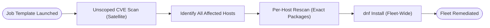
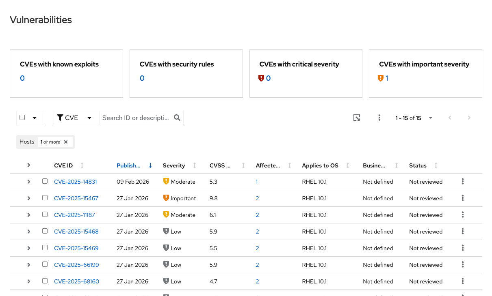
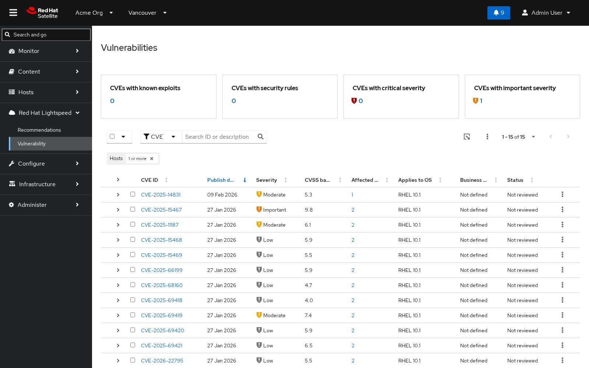
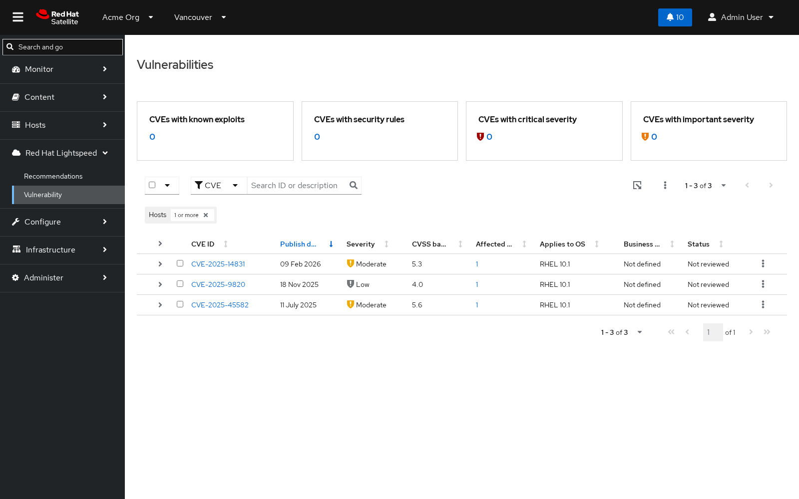


# Proactive Vulnerability Remediation with Satellite, Event-Driven Ansible, and Lightspeed On-Premises - Solution Guide <!-- omit in toc -->


## Overview

Security teams typically discover a critical CVE, cross-reference it against a fleet of hosts, look up the fixing erratum, and schedule a maintenance window, before a single package is patched. That gap between detection and remediation is where risk lives, and it grows every day the fleet sits unpatched. Every hour of manual triage is an hour a Critical or Important CVE remains exploitable across the fleet.

This guide demonstrates how to close that gap automatically using **Red Hat Satellite**, its on-premises **Red Hat Lightspeed Vulnerability** service, and **Event-Driven Ansible (EDA)**. A routine Satellite operation such as a successful remote execution job on any single host, fires a webhook that triggers a fleet-wide scan for remediable CVEs and installs the fixes, with zero manual intervention and zero data leaving the Satellite server. The CVE data and remediation logic are entirely on-premises so this pattern works in air-gapped environments.

**Operational Impact:** Medium to High -- fleet-wide package installs (see [Prerequisites](#prerequisites) for the per-stage breakdown).

**Business Value Drivers:**
- Cuts time-to-remediate for Critical/Important CVEs from days of manual triage to minutes of automated response
- Reduces audit and compliance risk by proving, with AAP job history, exactly when each CVE was closed and on which hosts

**Technical Value Drivers:**
- Eliminates bespoke scripting for CVE-to-package lookups by standardizing on Satellite's own Lightspeed Vulnerability and Katello APIs
- Keeps Satellite admin credentials out of playbooks and rulebooks entirely, using AAP Controller's credential injection

- [Background](#background)
- [Solution](#solution)
- [Prerequisites](#prerequisites)
- [Proactive Remediation Workflow](#proactive-remediation-workflow)
- [Solution Walkthrough](#solution-walkthrough)
- [Validation](#validation)
- [Maturity Path and Related Guides](#maturity-path-and-related-guides)

<h2 id="background"></h2>

## Background

<a target="_blank" href="https://www.redhat.com/en/technologies/management/satellite">Red Hat Satellite</a> is a systems management platform for provisioning, configuring, and maintaining RHEL hosts at scale. Among its capabilities is an on-premises **Red Hat Lightspeed Vulnerability** service: a page in the Satellite Web UI, under **Red Hat Lightspeed -> Vulnerability**, that cross-references each managed host's installed packages against CVE data already synced into Satellite. Despite sharing a name with the hosted `console.redhat.com` Lightspeed Vulnerability dashboard, this is a distinct, fully on-premises service. No host inventory or package list ever leaves the Satellite server.

Satellite also exposes a **webhook** subsystem: HTTPS callbacks that fire whenever a defined event occurs (a host registers, a content view publishes, a remote execution job succeeds). Combined with **Event-Driven Ansible**, a webhook becomes an automation trigger. EDA listens for the webhook's HTTP POST on an Event Stream, evaluates a rulebook's conditions against the event payload, and launches an AAP Job Template when a rule matches.

> **This is not the same as errata-based remediation.**
>
> Satellite's classic errata view lets an administrator remediate hosts by RHSA/RHBA/RHEA advisory. The Lightspeed Vulnerability service instead presents a CVE-centric view, cross-referenced against Satellite's Katello content API for the exact erratum and packages that fix each one. Both features remain available in Satellite; this guide automates the CVE-centric path. See the <a target="_blank" href="https://docs.redhat.com/en/documentation/red_hat_satellite/6.19/html/managing_hosts/patching-hosts-through-errata">Satellite documentation on patching through errata</a> for the difference in more depth.

<a target="_blank" href="https://www.redhat.com/en/technologies/management/ansible/event-driven-ansible">Event-Driven Ansible</a> is the bridge that turns a Satellite webhook into governed remediation, without teaching Satellite anything about AAP credentials or Satellite teaching AAP anything about its admin password.

<h2 id="solution"></h2>

## Solution

This solution wires together three components so that a single Satellite event triggers a fleet-wide remediation sweep:

- **Red Hat Satellite** for host management, the on-premises Lightspeed Vulnerability service, the Katello errata/content API, and the webhook that starts the loop
- **Event-Driven Ansible (EDA)** to receive the webhook via an Event Stream and launch the remediation Job Template through a rulebook
- **Ansible Automation Platform (AAP) Controller** to run the remediation playbook with a custom credential type (Satellite admin credentials injected, never hardcoded) and a custom Execution Environment

The actual event that triggers the proactive remediation workflow does not have to be a remote execution operation, as shown in this solution guide; the use of the remote execution event is arbitrary for demonstration purposes.

As well, the remediation action does not have to result in automatically patching hosts. You can configure other operations that align with your organization's information security policies. This can range from turning off selected systems, to quarantining selected VLANs, to patching RPMs in servers in test environments, perhaps resulting in smoke tests to check that a patch does not adversely affect the operation of critical systems.

### Who Benefits

| Persona | Challenge | What They Gain |
|---------|-----------|---------------|
| IT Ops Engineer / SRE | Manually cross-referencing CVE reports against host inventory, then patching hosts one at a time | A single Satellite event triggers automatic discovery and remediation across every affected host, not just the one that fired the event |
| Automation Architect | Building bespoke scripts to query vulnerability data and errata, and keeping Satellite credentials out of playbooks | A reusable credential-injection pattern and a documented EDA rulebook/Job Template wiring that works fully on-premises |
| IT Manager / Director | Patch compliance SLAs measured in days, with CVEs sitting exploitable while tickets move through a queue | Time-to-remediate measured in minutes for Critical/Important CVEs, with a severity-based policy and full AAP job audit trail |

## Prerequisites

### Ansible Automation Platform

- **Ansible Automation Platform 2.5+** - required for the EDA webhook Event Stream and the `ansible.controller`/`ansible.eda` collection features used in this guide

### Featured Ansible Content Collections

| Collection | Type | Purpose |
|-----------|------|---------|
| <a target="_blank" href="https://console.redhat.com/ansible/automation-hub/repo/published/ansible/eda/">ansible.eda</a> | Certified | EDA event sources - provides the `ansible.eda.webhook` source plugin that receives the Satellite webhook |
| <a target="_blank" href="https://console.redhat.com/ansible/automation-hub/repo/published/ansible/controller/">ansible.controller</a> | Certified | Programmatic creation of the Controller credential type, credential, Project, and Job Template |

### External Systems

| System | Required | Purpose |
|--------|----------|---------|
| Red Hat Satellite 6.19+ | Yes | Host management, on-premises Lightspeed Vulnerability data, Katello errata API, webhook source |
| Custom Execution Environment | Yes | Must include `uv` on `PATH`; `vulnerability_remediation.py` uses a `#!/usr/bin/env -S uv run --script` shebang, which AAP's stock EEs do not provide. Built and registered in Step 6 |
| SSH/Machine credential | Yes | The remediation playbook installs packages on each affected host over SSH |

**Operational Impact:** Medium to High - the closed-loop remediation step installs package updates on every affected host in the fleet. Scope the severity policy (Critical/Important by default) before enabling in production, and pilot on a non-production Satellite organization first.

### Inventory and Variables

> **Never hardcode the Satellite hostname.**
>
> Every featured playbook in this guide reads the target Satellite server from a `satellite_hostname` variable, not a literal URL. Define it once in inventory and it resolves everywhere. The same playbooks work against any Satellite instance without editing YAML.

```yaml
# inventory/hosts.yml
satellite:
  hosts:
    satellite01.example.com:
```

```yaml
# group_vars/satellite.yml
satellite_hostname: "{{ inventory_hostname }}"
satellite_validate_certs: false  # set true once a trusted CA cert is in place
```

The Job Template passes `satellite_hostname` (and the injected `satellite_username`/`SATELLITE_PASSWORD` from Step 7) into every play that talks to Satellite's API.

<h2 id="proactive-remediation-workflow"></h2>

## Proactive Remediation Workflow

The pipeline runs in two chained stages: the webhook that starts it, and the remediation sweep it triggers.




A successful remote execution job on any single host `web01.example.com` running a routine command, is the trigger. Satellite's webhook POSTs a JSON payload to AAP's EDA Event Stream, which validates the Basic Auth credential and delivers the event to a running rulebook Activation. The rulebook's single rule checks that the job succeeded, logs the event, and launches the **Vulnerability Package Finder and Remediator** Job Template, passing along the triggering host name for the audit trail only.

The Job Template's playbook does not stop at the triggering host. It first runs an **unscoped scan** against Satellite's Lightspeed Vulnerability and Katello errata APIs to discover every host in the fleet with at least one installable remediation for a Critical or Important CVE. It then re-scans each of those hosts individually to get the exact package list each one needs, and installs those packages via `dnf`. A webhook from one host is only the trigger; the remediation itself is fleet-wide.

### Operational Impact per Stage

| Stage | Impact | Notes |
|-------|--------|-------|
| 1. Satellite webhook fires | None | Read-only HTTPS callback |
| 2. EDA validates and routes the event | None | Basic Auth check against the Event Stream credential |
| 3. Unscoped CVE scan | None | Read-only query against Satellite's Vulnerability and Katello APIs |
| 4. Per-host rescan | None | Read-only, narrows the package list per host |
| 5. Install fixed packages | **High** | Applies package updates fleet-wide via `dnf` |

## Solution Walkthrough

### Step 1: Review Detected CVEs in the Lightspeed Vulnerability Dashboard

**Operational Impact:** None

Before wiring up any automation, Satellite already knows what is wrong. In the Satellite Web UI, under **Red Hat Lightspeed -> Vulnerability**, each detected CVE is listed with a severity rating (Critical/Important/Moderate/Low), a CVSS score, and a count of affected systems. Drilling into any CVE shows the full description and exactly which hosts it affects. This data comes entirely from CVE information already synced into Satellite, cross-referenced against each host's package list reported by `insights-client`. No data leaves the Satellite server.



Not every CVE is actionable yet. A CVE only becomes remediable once Satellite has synced an erratum that fixes it, which is exactly what the automation in the following steps checks for.

### Step 2: Register a Custom Webhook Template

**Operational Impact:** Low

Satellite's built-in webhook templates do not work for the remote-execution-success event this guide uses: the default payload template throws an internal error on this event type, and the other built-in template only emits human-readable text, not JSON. A custom ERB template renders real JSON instead:

```erb
<%#
name: Satellite Remote Execution Host Job JSON
description: JSON payload for actions.remote_execution.run_host_job_succeeded.event.foreman
snippet: false
model: WebhookTemplate
-%>
<%=
payload({
  host_name: @object.host_name,
  host_id: @object.host_id,
  job_invocation_id: @object.job_invocation_id,
  task_label: @object.task.label,
  task_state: @object.task.state,
  task_result: @object.task.result,
  task_started_at: @object.task.started_at,
  task_ended_at: @object.task.ended_at
})
-%>
```

`host_name` is the field that matters most. It is passed on to AAP as the triggering host for the audit trail. Register the template through Satellite's API rather than `hammer webhook-template create`, which errors on a duplicate name:

```yaml
- name: Create or update the Satellite webhook template
  hosts: satellite
  connection: local
  gather_facts: false
  tasks:
    - name: Read the ERB template body
      ansible.builtin.set_fact:
        webhook_template_body: "{{ lookup('file', 'satellite-remote-execution-host-job-json.erb') }}"

    - name: Register the webhook template with Satellite
      ansible.builtin.uri:
        url: "https://{{ satellite_hostname }}/api/webhook_templates"
        method: POST
        user: "{{ satellite_username }}"
        password: "{{ satellite_password }}"
        force_basic_auth: true
        validate_certs: "{{ satellite_validate_certs }}"
        body_format: json
        body:
          webhook_template:
            name: "Satellite Remote Execution Host Job JSON"
            template: "{{ webhook_template_body }}"
      no_log: true
```

`satellite_hostname` and `satellite_validate_certs` come from the `satellite` inventory group defined above, not a hardcoded URL. `no_log: true` keeps the credential-bearing request out of the job's visible output.

### Step 3: Create the Satellite Webhook Pointed at the EDA Event Stream

**Operational Impact:** Low

The webhook needs the Event Stream's Basic Auth credentials and its current URL, fetched live rather than trusted from a cached copy. The URL's UUID can drift if the credential is regenerated, and a stale one fails with `{"detail":"bad uuid specified"}`.

> **The webhook event name is a common source of confusion.**
>
> Satellite's create-webhook API takes `actions.remote_execution.run_host_job_succeeded` with no `.event.foreman` suffix, even though the info endpoint displays it with that suffix afterward. Query Satellite's `/api/webhooks/events` endpoint for its own spelling rather than guessing.

```yaml
- name: Create the Satellite webhook
  hosts: satellite
  connection: local
  gather_facts: false
  tasks:
    - name: Look up the exact event name Satellite expects
      ansible.builtin.uri:
        url: "https://{{ satellite_hostname }}/api/webhooks/events"
        method: GET
        user: "{{ satellite_username }}"
        password: "{{ satellite_password }}"
        force_basic_auth: true
        validate_certs: "{{ satellite_validate_certs }}"
      register: webhook_events
      no_log: true

    - name: Create the webhook, subscribed to the remote execution success event
      ansible.builtin.uri:
        url: "https://{{ satellite_hostname }}/api/webhooks"
        method: POST
        user: "{{ satellite_username }}"
        password: "{{ satellite_password }}"
        force_basic_auth: true
        validate_certs: "{{ satellite_validate_certs }}"
        body_format: json
        body:
          webhook:
            name: "AAP EDA Remediation Trigger"
            target_url: "{{ eda_event_stream_url }}"
            http_method: "POST"
            webhook_template_id: "{{ webhook_template_id }}"
            event: "{{ webhook_events.json | selectattr('name', 'match', '.*run_host_job_succeeded.*') | map(attribute='name') | first }}"
            user: "{{ eda_basic_auth_username }}"
            password: "{{ eda_basic_auth_password }}"
      no_log: true
```

Both tasks resolve `satellite_hostname` from inventory and set `no_log: true` because their request bodies carry the Satellite admin password and the EDA Basic Auth secret.

### Step 4: The EDA Rulebook - One Rule, Two Actions

**Operational Impact:** None

The rulebook that receives the webhook deliberately uses **one rule with two actions**, not two separate rules:

```yaml
---
- name: Satellite Remote Execution Webhook
  hosts: all
  sources:
    - ansible.eda.webhook:
        host: 0.0.0.0
        port: 5000
      name: satellite_webhook
  rules:
    - name: Log Satellite remote execution success and remediate CVEs
      condition: event.payload.task_result == "success"
      actions:
        - debug:
            msg: "Received Satellite webhook: {{ event }}"
        - run_job_template:
            name: "Vulnerability Package Finder and Remediator"
            organization: "Default"
            job_args:
              extra_vars:
                host_name: "{{ event.payload.host_name }}"
```

> **Why one rule instead of two.**
>
> The `ansible-rulebook` engine fires at most one rule per event. The first matching rule consumes it. A separate catch-all logging rule listed first would swallow every event, and a remediation rule behind it would never fire. Running the debug log and the `run_job_template` call as two actions of the same rule guarantees both happen.

### Step 5: The Remediation Playbook - Scan, Rescan, Install

**Operational Impact:** High (install phase only)

The Job Template runs `find_and_remediate.yml`, which performs an unscoped scan to discover which hosts have at least one installable remediation, then a per-host rescan for the exact package list, then installs the fixes:

```yaml
- name: Find CVE remediations for every affected host
  hosts: localhost
  connection: local
  gather_facts: false
  tasks:
    - name: Scan Satellite for all remediable CVEs and the hosts they affect
      ansible.builtin.command:
        cmd: >-
          python3 vulnerability_remediation.py
          --satellite https://{{ satellite_hostname }}
          --username {{ satellite_username }}
          --insecure
        chdir: "{{ playbook_dir }}"
      register: scan_all
      changed_when: false
      no_log: true

    - name: Build the set of hosts with at least one installable remediation
      ansible.builtin.set_fact:
        target_hosts: >-
          {{ (scan_all.stdout | from_json)
             | selectattr("has_remediation", "defined")
             | selectattr("has_remediation")
             | map(attribute="affected_systems")
             | sum(start=[])
             | unique }}

    - name: Re-scan each affected host for the exact packages it needs
      ansible.builtin.command:
        cmd: >-
          python3 vulnerability_remediation.py
          --satellite https://{{ satellite_hostname }}
          --username {{ satellite_username }}
          --host {{ item }}
          --insecure
        chdir: "{{ playbook_dir }}"
      loop: "{{ target_hosts }}"
      register: per_host_scans
      changed_when: false
      no_log: true

    - name: Hand each affected host and its package list to the next play
      ansible.builtin.add_host:
        name: "{{ item.item }}"
        groups: affected_hosts
        packages_to_install: >-
          {{ (item.stdout | from_json)
             | selectattr("packages_to_install_on_host", "defined")
             | map(attribute="packages_to_install_on_host")
             | select("truthy")
             | sum(start=[])
             | unique }}
      loop: "{{ per_host_scans.results }}"
      loop_control:
        label: "{{ item.item }}"

- name: Install the fixed packages on every affected host
  hosts: affected_hosts
  become: true
  gather_facts: false
  tasks:
    - name: Install/upgrade each package that remediates a found CVE
      ansible.builtin.dnf:
        name: "{{ item }}"
        state: present
      loop: "{{ hostvars[inventory_hostname].packages_to_install }}"
      when: hostvars[inventory_hostname].packages_to_install | length > 0
```

Both `command` tasks resolve `satellite_hostname` from inventory rather than a literal URL, and both set `no_log: true` because the script's exit output can echo the `--username` argument back in error messages. The password never appears on the command line. The controller injects it as the `SATELLITE_PASSWORD` environment variable (Step 7), and `vulnerability_remediation.py` reads it from there.

`vulnerability_remediation.py` (behind the scenes) logs in to Satellite and asks two on-premises APIs a question each: the Lightspeed Vulnerability service answers *"what CVEs affect my hosts?"*, and the Katello content API answers *"which erratum and packages fix each one?"*. By default it reports only CVEs rated Critical or Important. Widening that policy means passing additional `--severity` values.

### Step 6: Build and Register the Custom Execution Environment

**Operational Impact:** Low

`vulnerability_remediation.py` has a `#!/usr/bin/env -S uv run --script` shebang, and AAP's stock Execution Environments do not ship `uv`. The Job Template in Step 7 needs a custom Execution Environment built on top of the supported base image:

```dockerfile
FROM registry.redhat.io/ansible-automation-platform-25/ee-supported-rhel9:latest

RUN pip3 install --no-cache-dir uv
```

Build the image, tag it for a registry AAP's container runtime can reach, and push it. `EE_REGISTRY_HOSTNAME` is your own container registry, not a Satellite or AAP hostname:

```bash
export EE_REGISTRY_HOSTNAME=registry.example.com
podman build -t ee-vuln-finder -f Containerfile .
podman tag ee-vuln-finder:latest "$EE_REGISTRY_HOSTNAME/ee-vuln-finder:latest"
podman push "$EE_REGISTRY_HOSTNAME/ee-vuln-finder:latest"
```

Then register it in Controller, using the same `ansible.controller` collection as every other Controller object in this guide, rather than a raw API call:

```yaml
- name: Register the custom Execution Environment in Controller
  hosts: localhost
  connection: local
  gather_facts: false
  tasks:
    - name: Register the Vulnerability Finder Execution Environment
      ansible.controller.execution_environment:
        name: "Vulnerability Finder EE"
        image: "{{ ee_registry_hostname }}/ee-vuln-finder:latest"
        pull: missing
        state: present
```

`ee_registry_hostname` is an Ansible variable (define it in `group_vars`, the same way as `satellite_hostname`) with the same value as the `EE_REGISTRY_HOSTNAME` shell variable used above -- one is consumed by `podman`, the other by the Controller module.

> **The image must be reachable from Controller's container runtime, not just your workstation.**
>
> Controller pulls this image from the registry named in `image:` at job launch time, so that registry (and any TLS/auth it requires) must be reachable from the Controller node itself. `pull: missing` tells Controller to reuse the local image once cached, rather than re-pulling it on every job run.

### Step 7: Wire the Satellite Credential and AAP Job Template

**Operational Impact:** Low

The playbook needs Satellite admin credentials, but neither the rulebook nor the playbook should hold the password in plaintext. A custom Controller credential type solves this with `injectors`:

```yaml
- name: Create the Satellite API credential in Controller
  hosts: localhost
  connection: local
  gather_facts: false
  tasks:
    - name: Define the Satellite API credential type
      ansible.controller.credential_type:
        name: Satellite API Credentials
        kind: cloud
        inputs:
          fields:
            - id: username
              type: string
              label: Username
            - id: password
              type: string
              label: Password
              secret: true
          required:
            - username
            - password
        injectors:
          extra_vars:
            satellite_username: !unsafe '{{ username }}'
          env:
            SATELLITE_PASSWORD: !unsafe '{{ password }}'
        state: present

    - name: Create the Satellite admin credential
      ansible.controller.credential:
        name: Satellite Admin (API)
        organization: Default
        credential_type: Satellite API Credentials
        inputs:
          username: admin
          password: "{{ vaulted_satellite_password }}"
        state: present
```

At launch time, Controller hands the username to the playbook as the `satellite_username` extra var and the password as the `SATELLITE_PASSWORD` environment variable. This is exactly what `vulnerability_remediation.py` consumes. The password is never written into the playbook, the rulebook, or the repository.

> **`!unsafe` is required, not decoration.**
>
> `{{ username }}` and `{{ password }}` are Controller's own templates, filled in at launch time. Without `!unsafe`, Ansible tries to resolve them while creating the credential type and fails on an undefined variable.

**Job Template configuration:**

| Field | Value |
|-------|-------|
| **Name** | `Vulnerability Package Finder and Remediator` |
| **Playbook** | `find_and_remediate.yml` |
| **Execution Environment** | `Vulnerability Finder EE` (built and registered in Step 6) |
| **Credentials** | `Satellite Admin (API)`, Machine credential (SSH, `become: true`) |
| **Ask Variables on Launch** | `true` - required so the rulebook can pass `host_name` as an extra var |

> **RBAC:** Scope roles tightly.
>
> Assign the `Execute` role on this Job Template only to the automation team responsible for patch compliance. The Machine credential attached here connects as `root` on every managed host, so `Admin` on the Job Template should be limited to the automation architect team.

> **Missing the Machine credential is a common failure.**
>
> The scan plays run `hosts: localhost` and always succeed. The install play runs against `affected_hosts` over SSH. Without a Machine credential attached, it fails with `Permission denied (publickey)`.

## Validation

### The Test

Trigger a routine remote execution job against any single managed host. This is the same kind of job Satellite runs for day-to-day administration. The only difference is that a *successful* run of one now fires the webhook into AAP:

```bash
hammer job-invocation create \
  --job-template "Run Command - Ansible Default" \
  --search-query "name = web01.example.com" \
  --inputs "command=echo trigger-remediation"
```

### Expected Result

Before triggering, both `web01.example.com` and `web02.example.com` report the vulnerable package versions:

```
$ rpm -q openssl openssl-libs gnutls tar
openssl-3.5.1-4.el10_1.x86_64
openssl-libs-3.5.1-4.el10_1.x86_64
gnutls-3.8.10-2.el10.x86_64
tar-1.35-7.el10.x86_64
```



Watch the **Vulnerability Package Finder and Remediator** Job Template launch and complete. Once it finishes, both hosts show the patched OpenSSL packages, even though only `web01.example.com` fired the webhook:

```
$ rpm -q openssl openssl-libs gnutls tar
openssl-3.5.1-7.el10_1.x86_64
openssl-libs-3.5.1-7.el10_1.x86_64
gnutls-3.8.10-2.el10.x86_64
tar-1.35-7.el10.x86_64
```

| Package | Before | After | Result |
|---------|--------|-------|--------|
| `openssl` | `3.5.1-4.el10_1` | `3.5.1-7.el10_1` | Upgraded by RHSA-2026:1472 (**Important**) |
| `openssl-libs` | `3.5.1-4.el10_1` | `3.5.1-7.el10_1` | Upgraded by RHSA-2026:1472 (**Important**) |
| `gnutls` | `3.8.10-2.el10` | `3.8.10-2.el10` | Not remediated -- Moderate, below threshold |
| `tar` | `1.35-7.el10` | `1.35-7.el10` | Not remediated -- Moderate, below threshold |

Only the Critical/Important CVE (`CVE-2025-15467`, CVSS 9.8) was auto-remediated. The `gnutls` and `tar` errata are Moderate severity, below this policy's default threshold. That is the policy working as intended and it is not a gap.

The Job Template's `PLAY RECAP` shows one line per affected host. A host already up to date shows `skipped`; a host that needed patches shows `changed`:

```
PLAY RECAP *********************************************************************
web01.example.com : ok=2    changed=1    unreachable=0    failed=0    skipped=0
web02.example.com : ok=2    changed=1    unreachable=0    failed=0    skipped=0
```

Finally, run `insights-client` on both hosts so Satellite's own package inventory catches up. `rpm -q` reflects the change instantly, but the Lightspeed Vulnerability dashboard only clears the CVE once Satellite re-matches against freshly uploaded package data:

```bash
insights-client
```

Reload **Red Hat Lightspeed -> Vulnerability** in the Satellite Web UI. The Important-severity OpenSSL CVE that previously showed **Systems Affected = 2** no longer appears:



### Troubleshooting

| Symptom | Likely Cause | Fix |
|---------|-------------|-----|
| Webhook template throws a Ruby error in `production.log` | Using a built-in webhook template instead of the custom JSON one | Check `/var/log/foreman/production.log` for `EventSubscriber` errors; re-register the custom ERB template from Step 2 |
| Satellite webhook rejected with `{"detail":"bad uuid specified"}` | Event Stream URL is stale (credential was regenerated after the webhook was created) | Re-fetch the current Event Stream URL from EDA's API and recreate the webhook |
| `events_received` counter on the Event Stream never increments | Basic Auth mismatch, or the webhook event name is wrong | Verify credentials; confirm the event name via `/api/webhooks/events` rather than guessing the `.event.foreman` suffix |
| Job Template fails immediately with a missing `uv` error | Stock AAP Execution Environment used instead of the custom `Vulnerability Finder EE` | Rebuild and push the image from Step 6's Containerfile, then confirm the Job Template's Execution Environment field points at `Vulnerability Finder EE` |
| Install play fails with `Permission denied (publickey)` | Machine credential not attached to the Job Template | Attach the SSH Machine credential used to connect as `root` on managed hosts |
| Scan runs but reports no remediable CVEs | Severity filter excludes the CVE, or Satellite hasn't synced the fixing erratum yet | Confirm the CVE is rated Critical or Important, and that Satellite has synced the corresponding erratum |
| Vulnerability dashboard still shows the CVE after remediation | `insights-client` hasn't run on all affected hosts yet | Run `insights-client` on every affected host; the dashboard only clears once every affected host's inventory is refreshed |

<h2 id="maturity-path-and-related-guides"></h2>

## Maturity Path and Related Guides

| Maturity | Description |
|----------|-------------|
| **Crawl** | Manual, errata-based remediation via the Satellite Web UI - an administrator reviews the Vulnerability dashboard and applies fixes by hand |
| **Walk** | Webhook-triggered remediation scoped to Critical/Important severity, launched automatically from a single Satellite event but reviewed via AAP job history |
| **Run** | Policy-driven severity thresholds, additional Satellite event types beyond remote-execution success, and scheduled `insights-client` runs so the dashboard reflects fleet state continuously |

### Related Guides

- [AIOps automation with Ansible](README-AIOps.md) -- the foundational Event-Driven Ansible reference architecture this guide's webhook-to-remediation pattern builds on
- <a target="_blank" href="https://access.redhat.com/articles/7136720">Get started with EDA (Ansible Rulebook)</a> -- new to Event-Driven Ansible? Start here for rulebook and event source fundamentals

### ROI Recap

> **Completed:** The closed-loop remediation pipeline is live.
>
> A single Satellite event now triggers fleet-wide discovery and remediation of Critical and Important CVEs, cutting time-to-remediate from days of manual triage to minutes, with zero credentials exposed and a full AAP audit trail.

## Sources

- <a target="_blank" href="https://www.redhat.com/en/technologies/management/ansible">Red Hat Ansible Automation Platform</a>
- <a target="_blank" href="https://www.redhat.com/en/technologies/management/satellite">Red Hat Satellite</a>
- <a target="_blank" href="https://docs.redhat.com/en/documentation/red_hat_satellite/6.19/html/managing_hosts/patching-hosts-through-errata">Red Hat Satellite documentation - patching hosts through errata</a>

