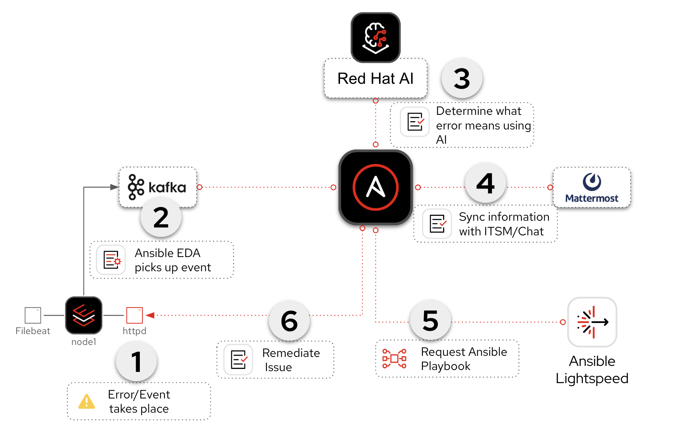

# AIOps Hub - Solution Guide for Ansible Automation Platform customers

## Overview

## Background

**AIOps** stands for *artificial intelligence* for IT operations. It refers both to a modern approach to managing IT operations and to the software systems that implement it. AIOps uses data science, big data, and machine learning to augment—or even automate—many traditionally manual IT tasks. The goal is to improve issue detection, root cause analysis, and system resolution.

📖 <a target="_blank" href="https://www.redhat.com/en/topics/ai/what-is-aiops">What is AIOps? – redhat.com</a>

There are three major parts of AIOps:

- 🔍 **Observability**
- 🧠 **Inference**
- ⏩ **Automation**

- **Observability**: Understanding the internal state of a system through logs, metrics, and traces.
   - 📖 <a target="_blank" href="https://www.redhat.com/en/topics/devops/what-is-observability">What is observability? - redhat.com </a>
- **Inference**: Using AI models to make predictions based on new data.
   - 📖 <a target="_blank" href="https://www.redhat.com/en/topics/ai/what-is-ai-inference">What is AI inference? - redhat.com</a>
- **Automation**: Automatically detect, respond to, and resolve IT issues.
   - 📖 <a target="_blank" href="https://www.redhat.com/en/technologies/management/ansible?sc_cid=70160000000KGIPAA4">Red Hat Ansible Automation Platform - redhat.com</a>

**Ansible Automation Platform** connects **observability** and **inference** to build **self-healing infrastructure.**

> ⚠️ AIOps adoption can be incremental. You don’t need full automation on Day One. *Start small, think big!*

# Solution

What makes up the solution?

- 🧠 **Red Hat AI** for understanding service issues <a target="_blank" href="https://www.redhat.com/en/products/ai">[Link]</a>
- ✨ **Ansible Lightspeed** to generate remediation playbooks <a target="_blank" href="https://www.redhat.com/en/technologies/management/ansible/ansible-lightspeed">[Link]</a>
- 🔁 **Ansible Automation Platform (AAP)** workflows for orchestration <a target="_blank" href="https://www.redhat.com/en/technologies/management/ansible">[Link]</a>
- 📡 **Event-Driven Ansible (EDA)** to listen to real-time service events <a target="_blank" href="https://www.redhat.com/en/technologies/management/ansible/event-driven-ansible">[Link]</a>

> 💡 EDA (Event-Driven Ansible) is part of Ansible Automation Platform.  It is referred to separately sometimes depending on the workflow.  EDA uses rulebooks to monitor events, then executes specified job templates or workflows based on the event.  Think of it simply as inputs and outputs.  EDA is an automatic way for inputs into Ansible Automation Platform, where Automation controller / Automation execution is the output (running a job template or workflow).

- 🎥 [YouTube video (~2 min)](https://youtu.be/a3fCHd2vTXU?si=L_5jGYZFtb3SzCJq)
- 📢 [Please consider subscribing to the Ansible Team!](https://youtube.com/ansibleautomation?sub_confirmation=1)

## AIOps Workflow

An AIOps workflow has four (4) parts:

1. **Event-Driven Ansible (EDA) Response**

   Respond to an event, such as a systemd application outage.  This falls under the **Observability** part of the AIOps workflow.  EDA allows us to plug-in **observability** to an **automation** workflow.

2. **Log Enrichment and Prompt Generation Workflow**

   AAP coordinates with Red Hat AI, notifies your chat application or ITSM (IT service management tool).  This falls under the **Inference** part of the AIOps workflow.  Again, Ansible Automation Platform ties this into an **automation** workflow.

3. **Remediation Workflow**

   Generates a playbook via Ansible Lightspeed, syncs it to Git, builds another Job Template.  This also falls uner **Interference** part of the AIOps workflow.  For this solution we are using one AI LLM endpoint (Red hat AI) to figure out what the issue is and diagnose it, and one AI LLM endpoint to create an Ansible Playbook to remediate the issue.  This is considered a A **multi-LLM workflow**, as we are using 2 or more LLM endpoints within our workflow.

4. **Execute  Remediation**

   The final Job Template that fixes the issue on your IT infrastrucure.  This is executing the Ansible Playbook that was generated in the previous workflow.  This falls under the **automation** part of AIOps and wraps up our self healing infrastructure use-case..

> 💡 Could this be one workflow? Yes — but it’s broken up for review points and easier adoption.

### Example Workflow Diagram

This is a workflow **example** from our hands-on workshop **Introduction to AI-Driven Ansible Automation**

> ❓ **Why Mattermost?**
> An open-source alternative to Slack/MS Teams. Used for this lab, but can be swapped for your favorite chat or ITSM system (e.g. *ServiceNow*).

> ❓ **Why Gitea?**
> Lightweight self-hosted Git. Replaceable with *GitHub*, *GitLab*, etc. Ideal for hands-on workshops.

> ❓ **Why Kafka?**
> Open-source event streaming platform. Replaceable with other buses like AWS SQS, Azure Service Bus, Prometheus, etc. EDA supports many integrations.

## Event-Driven Ansible (EDA) Response

The first part of the AIOps workflow is the EDA response.  This falls under the

- RHEL node with Apache (`httpd`)
- Filebeat monitors Apache logs
- Kafka acts as the event transport
- EDA listens to Kafka, launches workflows
- Red Hat AI infers incident context
- Ansible Lightspeed generates remediation playbooks
- Gitea manages playbooks via Git
- AAP executes jobs and workflows

> 💡 **EDA (Event-Driven Ansible)** is a part of AAP that uses rulebooks to monitor events and execute job templates or workflows. Think: inputs (events) → EDA → outputs (job runs).
>

## Detailed workflow diagram

- Filebeat monitors Apache logs
- Kafka acts as the event transport
- - EDA listens to Kafka, launches workflows

## Log Enrichment and Prompt Generation Workflow
   AAP coordinates with Red Hat AI, notifies Mattermost, auto-creates a Job Template

## Remediation Workflow
   Generates a playbook via Ansible Lightspeed, syncs it to Git, builds another Job Template

## Execute HTTPD Remediation
   The final Job Template that fixes the Apache outage

Each module breaks down its part of the workflow. Together, we'll make AIOps easy to adopt and scale 🎉

---

